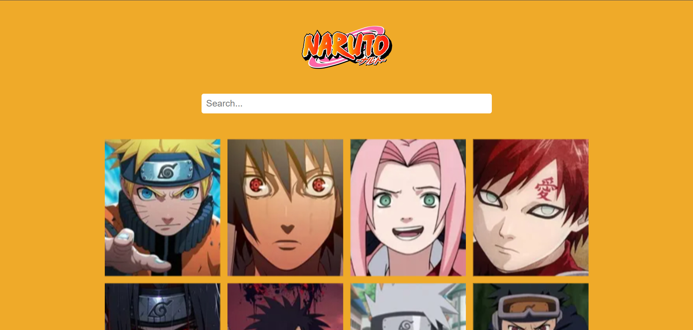
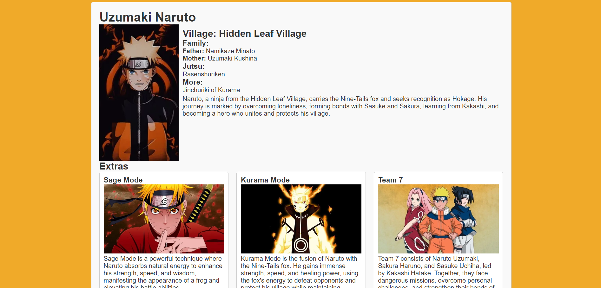
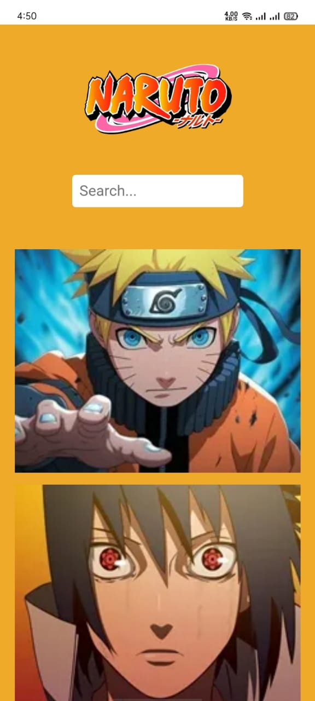
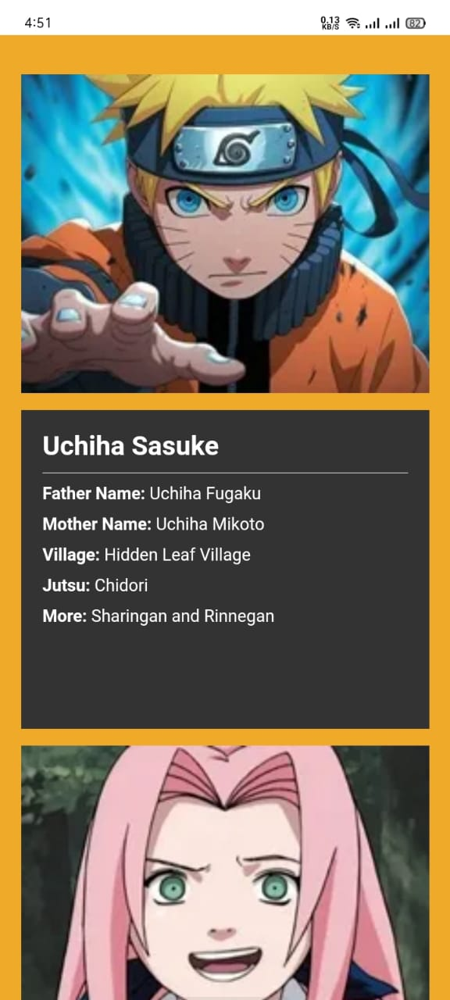
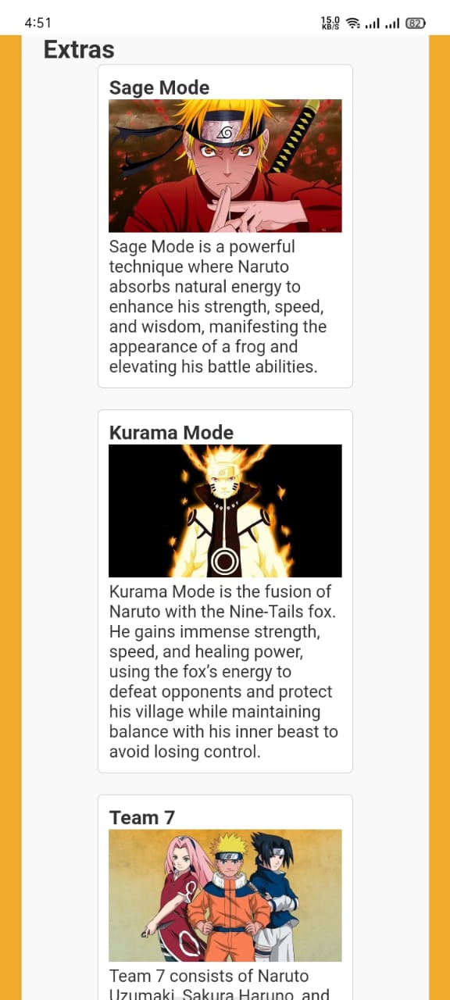

# Anime Project

It is a simple React application that fetches and displays a list of Naruto anime characters from an external API.

## Features

- Fetches anime data from an API.
- On hover you see the character details
- Displays anime in a visually appealing format.
- Responsive design for different screen sizes.

## Installation

To run this project locally, follow these steps:

1. **Clone the repository:**
```bash
  git clone https://github.com/alecodify/react-projects.git
```

2. **Navigate to the project directory:**
```bash
  cd react-projects/01-anime
```

3. **Install the dependencies:**
```bash
  npm install    
```

4. **Start the development server:**
```bash
  npm run dev
```

Once the server is running, you can access the application in your browser at http://localhost:5173.

## Demo
[Watch the demo video](https://github.com/user-attachments/assets/45a5d4c7-7897-485d-bd7d-520a42a9ea65)

## Screenshots


<div style="display: flex; flex-direction: 'row';">



</div>

## Contributing
Contributions are welcome! Please feel free to submit a Pull Request.

## Contact
For any questions or issues, please reach out to imaliraza10@gmail.com