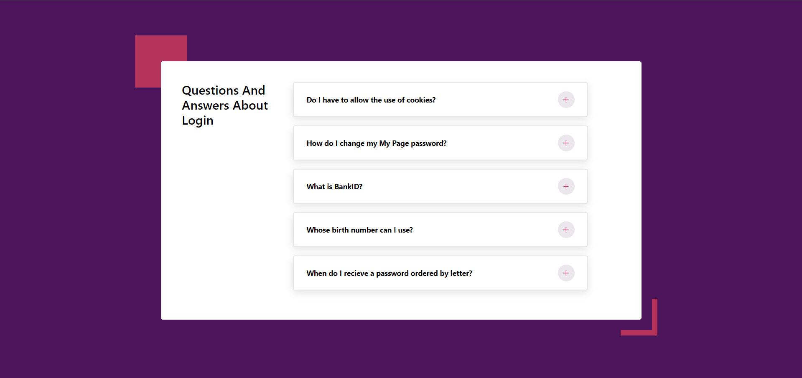
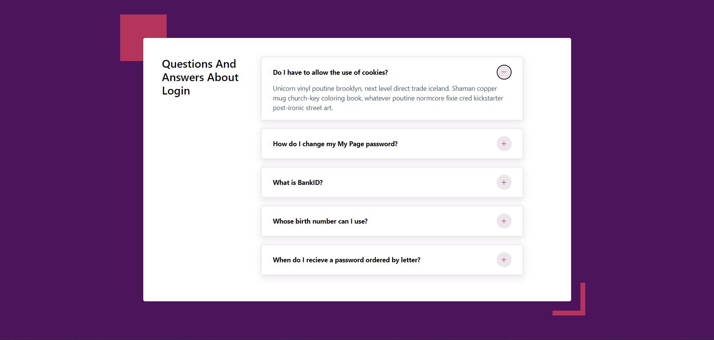
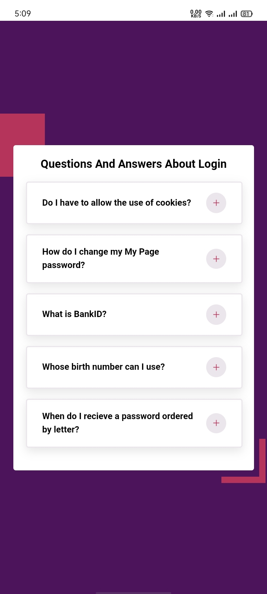
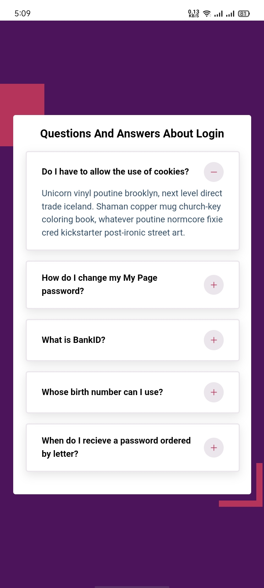

# Accordion Project

The Accordion Project is a common UI pattern that allows users to toggle the visibility of content sections. This project demonstrates the use of React's state management and conditional rendering to create an interactive Accordion.

## Features

- Click on a section header to expand or collapse the content.
- The Accordion provides a smooth user experience with CSS transitions.

## Installation

To run this project locally, follow these steps:

1. **Clone the repository:**
```bash
  git clone https://github.com/alecodify/react-projects.git
```

2. **Navigate to the project directory:**
```bash
  cd react-projects/02-accordion
```

3. **Install the dependencies:**
```bash
  npm install    
```

4. **Start the development server:**
```bash
  npm run dev
```

Once the server is running, you can access the application in your browser at http://localhost:5173.

## Demo
[Watch the demo video](https://github.com/user-attachments/assets/f6db1f7f-9f85-424c-9041-095e860d714e)

## Screenshots


<div style="display: flex; flex-direction: 'row';">


</div>

## Contributing
Contributions are welcome! Please feel free to submit a Pull Request.

## Contact
For any questions or issues, please reach out to imaliraza10@gmail.com