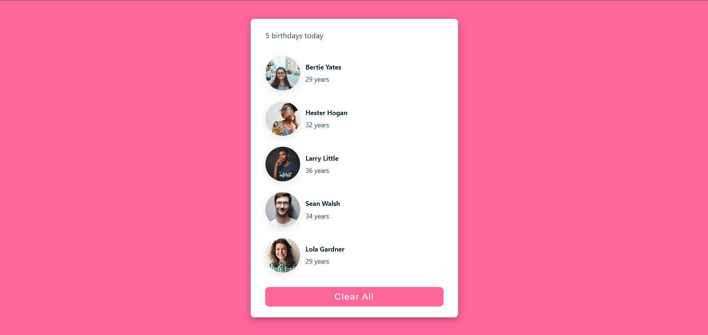
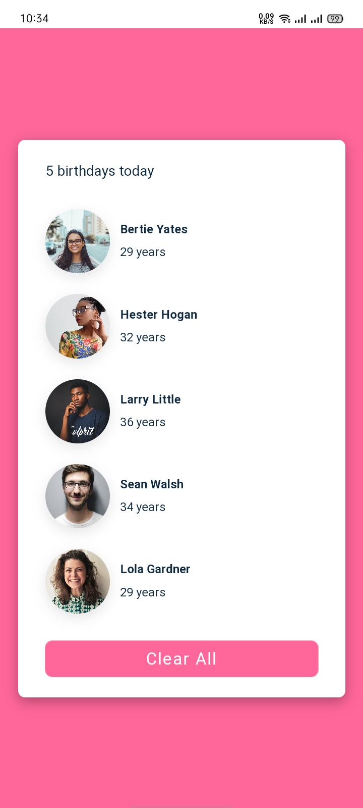

# Birthday Reminder

A simple React application that displays a list of people with upcoming birthdays. Users can easily manage and update the list to stay organized and ensure no birthday is missed!

## Features

- Display a list of people with their birthdays.
- Easily clear the list with a single click.
- Simple and user-friendly interface.
- Responsive design for all screen sizes.

## Installation

To run this project locally, follow these steps:

1. **Clone the repository:**
```bash
  git clone https://github.com/alecodify/react-projects.git
```

2. **Navigate to the project directory:**
```bash
  cd react-projects/03-birthday-reminder
```

3. **Install the dependencies:**
```bash
  npm install    
```

4. **Start the development server:**
```bash
  npm run dev
```

Once the server is running, you can access the application in your browser at http://localhost:5173.

## Screenshots



## Contributing
Contributions are welcome! Please feel free to submit a Pull Request.

## Contact
For any questions or issues, please reach out to imaliraza10@gmail.com