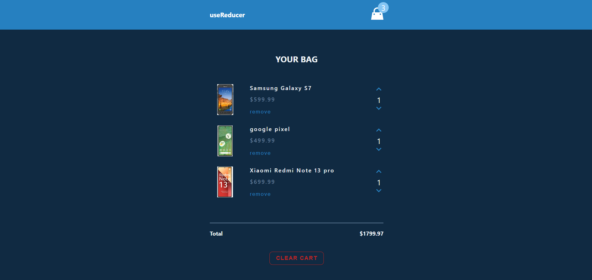
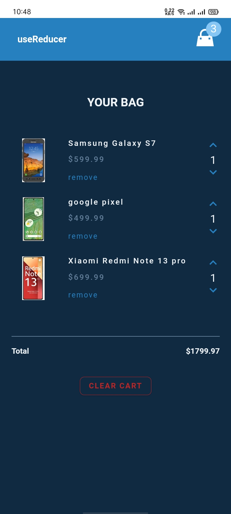

# Cart

A simple shopping cart application built with React. This project demonstrates the implementation of a basic cart system, where users can add or remove items, increase or decrease quantities, and view the total cost dynamically.

## Features

- Displays a list of products in the cart.
- Ability to increase or decrease the quantity of products.
- Remove items from the cart.
- Dynamic update of total price based on cart contents.
- Responsive design for all screen sizes.


## Installation

To run this project locally, follow these steps:

1. **Clone the repository:**
```bash
  git clone https://github.com/alecodify/React-Projects.git
```

2. **Navigate to the project directory:**
```bash
  cd React-Projects/04-cart
```

3. **Install the dependencies:**
```bash
  npm install    
```

4. **Start the development server:**
```bash
  npm run dev
```

Once the server is running, you can access the application in your browser at http://localhost:5173.

## Demo
<video width="100%" controls>
  <source src="./screenshots/vedio.mp4" type="video/mp4">
  Your browser does not support the video tag.
</video>

## Screenshots





## Contributing
Contributions are welcome! Please feel free to submit a Pull Request.

## Contact
For any questions or issues, please reach out to imaliraza10@gmail.com