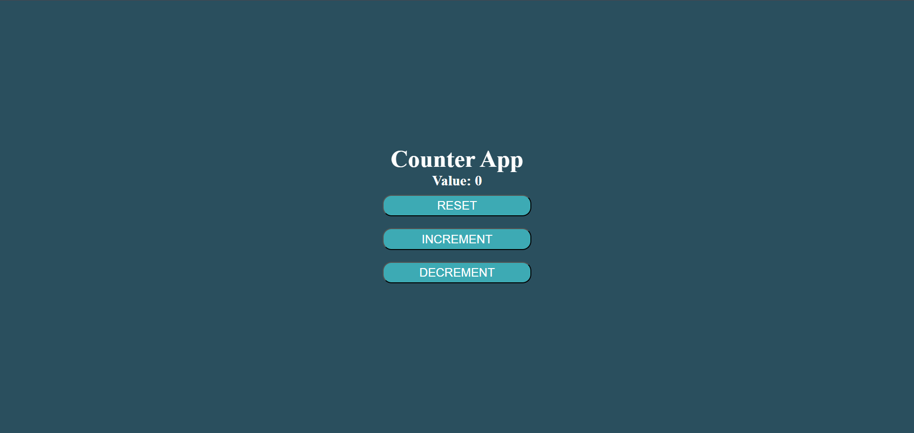
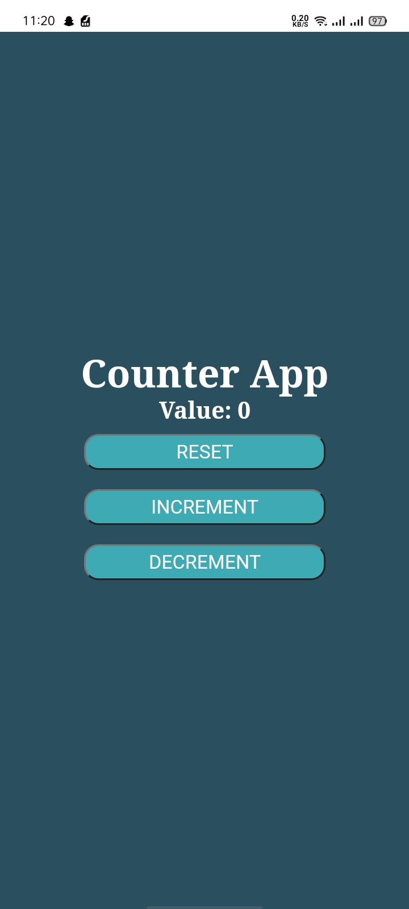

# Counter

This project is a simple Counter application built using React, showcasing the fundamentals of state management and user interaction with buttons to increment, decrement, and reset the count.

## Features

- Increase or decrease the count by clicking the respective buttons.
- Reset the count to the initial value of 0.
- The displayed count updates in real time as the user interacts with the buttons.


## Installation

To run this project locally, follow these steps:

1. **Clone the repository:**
```bash
  git clone https://github.com/alecodify/React-Projects.git
```

2. **Navigate to the project directory:**
```bash
  cd React-Projects/05-counter
```

3. **Install the dependencies:**
```bash
  npm install    
```

4. **Start the development server:**
```bash
  npm run dev
```

Once the server is running, you can access the application in your browser at http://localhost:5173.

## Demo
[Watch the demo video](./screenshots/vedio.mp4)


## Screenshots



## Contributing
Contributions are welcome! Please feel free to submit a Pull Request.

## Contact
For any questions or issues, please reach out to imaliraza10@gmail.com