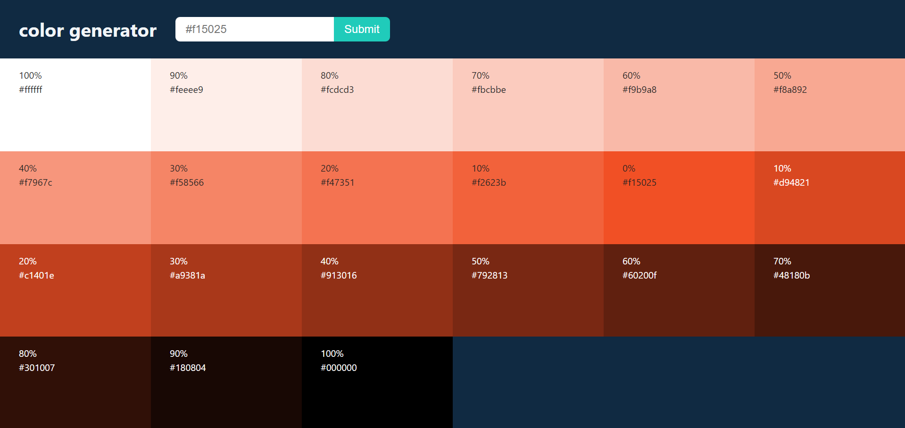
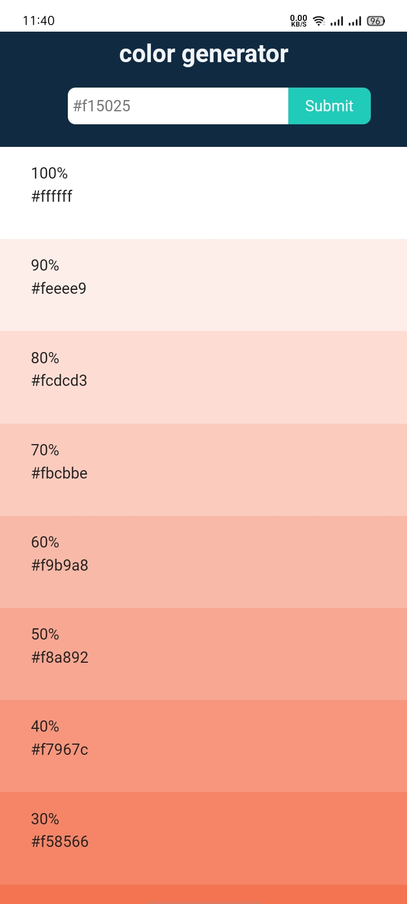
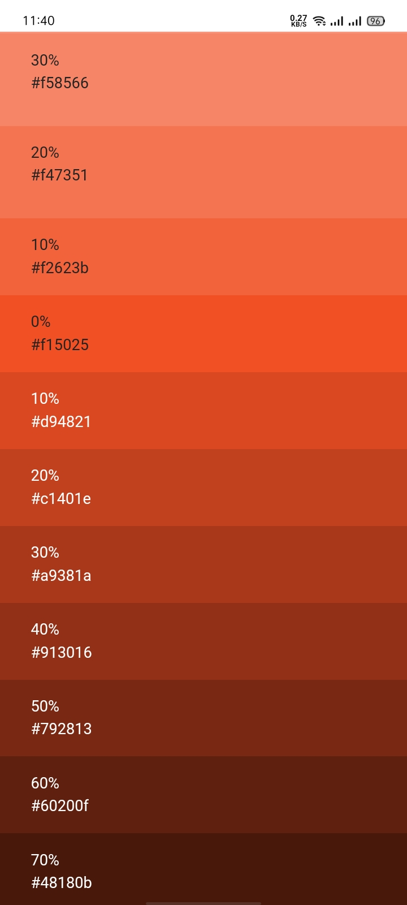
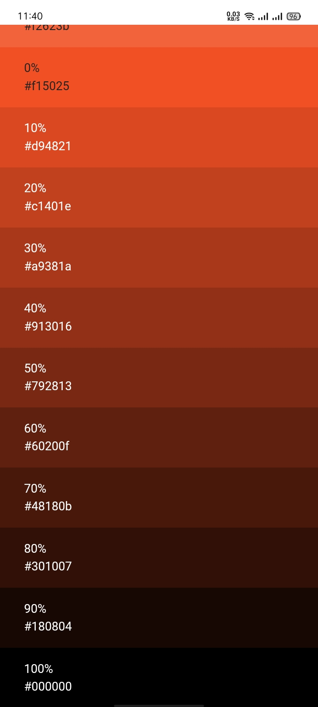

# Color Generator

This Project allows users to generate and copy random colors, demonstrating the use of state management, random number generation, and basic styling with React.

## Features

- Click the button to generate a random color.
- Copy the color code to your clipboard for use elsewhere.
- The color and its code update in real time as you generate new colors.


## Installation

To run this project locally, follow these steps:

1. **Clone the repository:**
```bash
  git clone https://github.com/alecodify/React-Projects.git
```

2. **Navigate to the project directory:**
```bash
  cd React-Projects/06-color-generator
```

3. **Install the dependencies:**
```bash
  npm install    
```

4. **Start the development server:**
```bash
  npm run dev
```

Once the server is running, you can access the application in your browser at http://localhost:5173.

## Demo
[Watch the demo video](https://github.com/user-attachments/assets/e5d38487-3c95-456a-962a-0c4124980aaa)


## Screenshots

<div style="display: flex; flex-direction: 'row';">



</div>

## Contributing
Contributions are welcome! Please feel free to submit a Pull Request.

## Contact
For any questions or issues, please reach out to imaliraza10@gmail.com