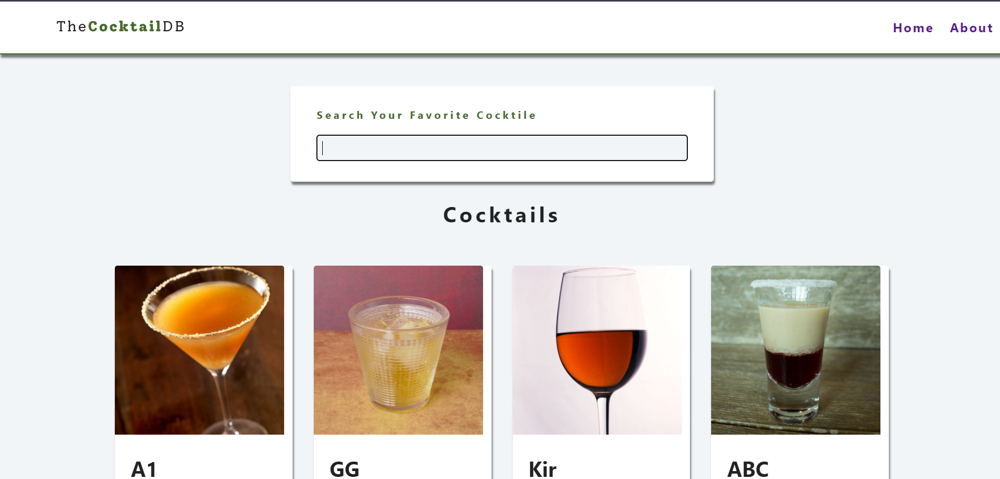
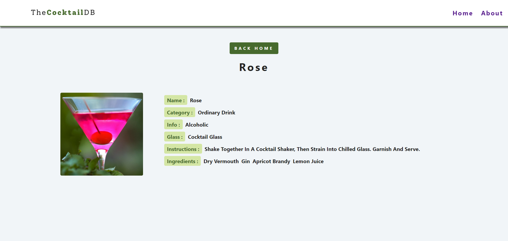
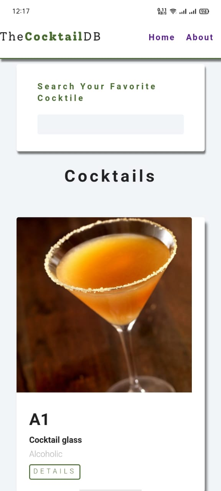
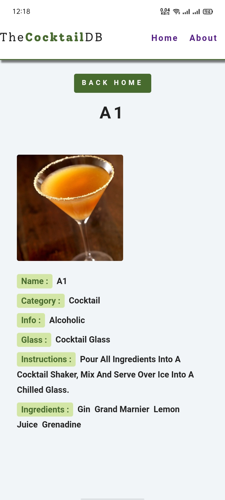
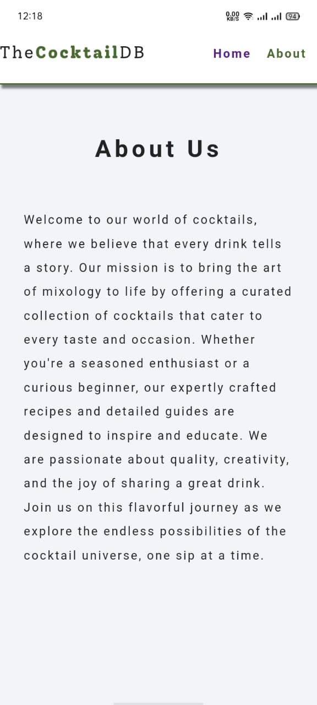

# Cocktail

This Project allows users to search for cocktails, view details about each cocktail, and see a list of cocktails based on their search criteria. This project demonstrates the use of React for fetching and displaying data from an API, as well as handling user interactions.

## Features

- Enter a search term to find cocktails that match.
- Click on a cocktail to see its ingredients and instructions.
- The app is designed to work on both desktop and mobile devices.


## Installation

To run this project locally, follow these steps:

1. **Clone the repository:**
```bash
  git clone https://github.com/alecodify/react-projects.git
```

2. **Navigate to the project directory:**
```bash
  cd react-projects/07-cocktail
```

3. **Install the dependencies:**
```bash
  npm install    
```

4. **Start the development server:**
```bash
  npm run dev
```

Once the server is running, you can access the application in your browser at http://localhost:5173.

## Demo
[Watch the demo video](https://github.com/user-attachments/assets/cb4c288f-7dac-4c17-95bf-0aa3bd38340c)


## Screenshots


<div style="display: flex; flex-direction: 'row';">



</div>

## Contributing
Contributions are welcome! Please feel free to submit a Pull Request.

## Contact
For any questions or issues, please reach out to imaliraza10@gmail.com