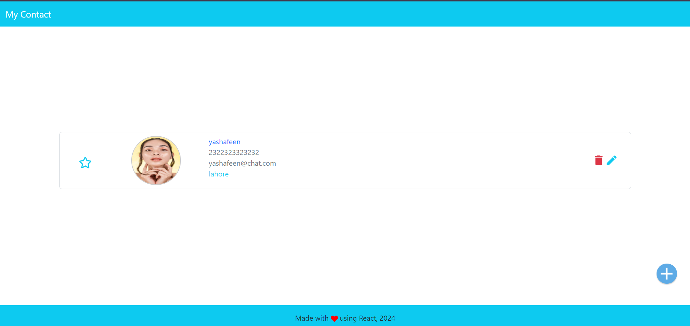

# Contact

This project allows users to manage their contacts, including adding, editing, and deleting contact information. The project demonstrates React's state management, form handling, and CRUD operations.

## Features

- Add new contacts with details like name, phone number, and email.
- Modify existing contact details.
- Remove contacts from the list.
- Display all contacts in a user-friendly format.


## Installation

To run this project locally, follow these steps:

1. **Clone the repository:**
```bash
  git clone https://github.com/alecodify/React-Projects.git
```

2. **Navigate to the project directory:**
```bash
  cd React-Projects/08-contact
```

3. **Install the dependencies:**
```bash
  npm install    
```

4. **Start the development server:**
```bash
  npm run dev
```

Once the server is running, you can access the application in your browser at http://localhost:5173.

## Demo
[Watch the demo video](https://github.com/user-attachments/assets/a32cd68e-4420-44b4-b731-401cfb60dc47)


## Screenshots

<div style="display: flex; flex-direction: 'row';">

</div>

## Contributing
Contributions are welcome! Please feel free to submit a Pull Request.

## Contact
For any questions or issues, please reach out to imaliraza10@gmail.com