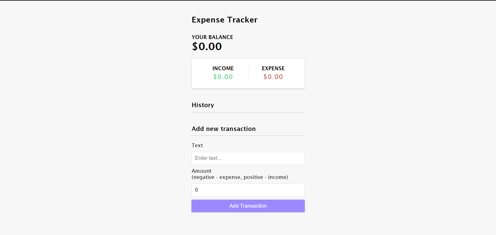
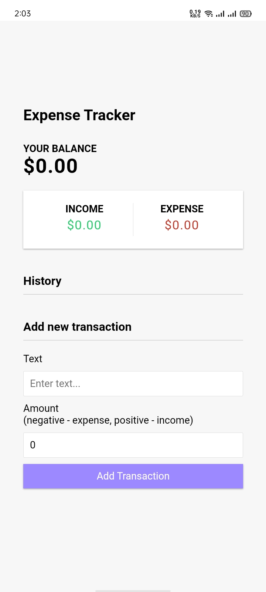

# Expense Tracker

This project allows users to track their expenses, manage their budget, and visualize their spending habits.

## Features

- Add income or expense transactions with descriptions and amounts.
- See a list of all transactions with their details.
- Display the total balance, including income and expenses.


## Installation

To run this project locally, follow these steps:

1. **Clone the repository:**
```bash
  git clone https://github.com/alecodify/react-projects.git
```

2. **Navigate to the project directory:**
```bash
  cd react-projects/10-expense-tracker
```

3. **Install the dependencies:**
```bash
  npm install    
```

4. **Start the development server:**
```bash
  npm run dev
```

Once the server is running, you can access the application in your browser at http://localhost:5173.

5. **For Backend:**
```bash
  cd react-projects/10-expense-tracker/server
```

6. **Start the Backend**
```bash
  npm start
```
Open your browser and go to `http://localhost:9000` to see the application in action.

## Demo
[Watch the demo video](https://github.com/user-attachments/assets/31b5b1dc-df14-4590-aa59-f3e11a8039b5)


## Screenshots

<div style="display: flex; flex-direction: 'row';">

</div>

## Contributing
Contributions are welcome! Please feel free to submit a Pull Request.

## Contact
For any questions or issues, please reach out to imaliraza10@gmail.com