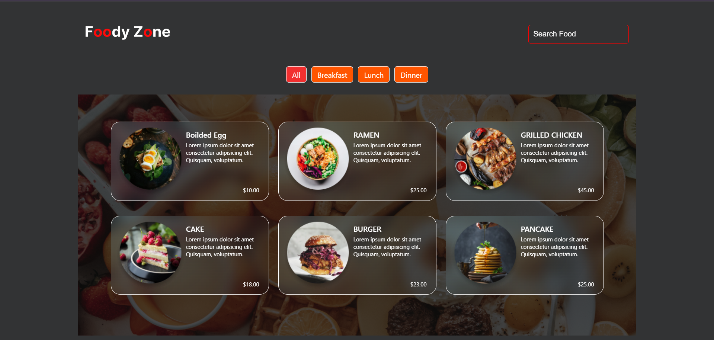
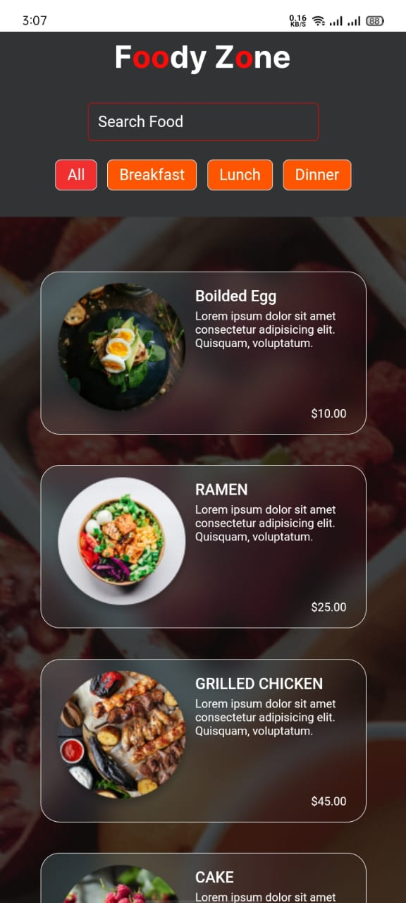

# Food

This project allows users to search for and filter different food items.

## Features

- Search for food items by name
- Filter food items by categories
- Responsive design for better user experience on mobile and desktop devices


## Installation

To run this project locally, follow these steps:

1. **Clone the repository:**
```bash
  git clone https://github.com/alecodify/react-projects.git
```

2. **Navigate to the project directory:**
```bash
  cd react-projects/11-food/client
```

3. **Install the dependencies:**
```bash
  npm install    
```

4. **Start the development server:**
```bash
  npm run dev
```

Once the server is running, you can access the application in your browser at http://localhost:5173.

5. **For Backend:**
```bash
  cd react-projects/11-food/server
```

6. **Install the dependencies:**
```bash
  npm install    
```

7. **Start the Backend**
```bash
  npm start
```
Open your browser and go to `http://localhost:3000` to see the application in action.

## Demo
[Watch the demo video](https://github.com/user-attachments/assets/63ca90a3-cf79-4710-8cd6-ce88aef8dd7b)


## Screenshots

<div style="display: flex; flex-direction: 'row';">

</div>

## Contributing
Contributions are welcome! Please feel free to submit a Pull Request.

## Contact
For any questions or issues, please reach out to imaliraza10@gmail.com