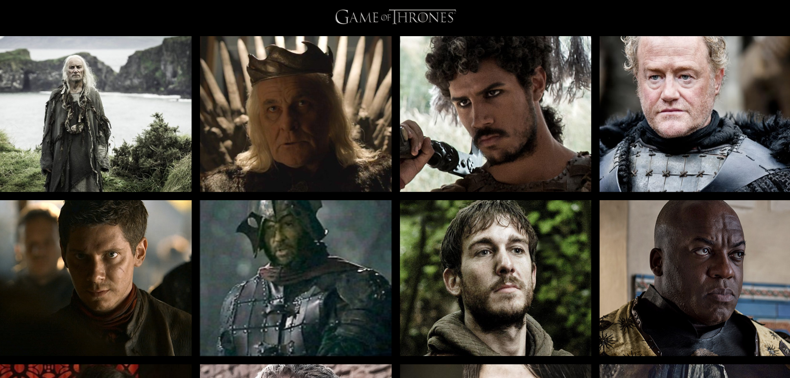
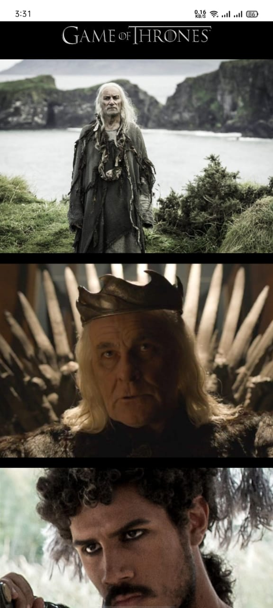

# Game of Thrones

This project allows users to show all characters from the popular TV show "Game of Thrones" using an external API. It demonstrates how to fetch data and display results in a user-friendly interface.

## Features

- Show Game of Thrones characters image
- On hover display character details including name, house, and nickname
- User-friendly interface with responsive design


## Installation

To run this project locally, follow these steps:

1. **Clone the repository:**
```bash
  git clone https://github.com/alecodify/React-Projects.git
```

2. **Navigate to the project directory:**
```bash
  cd React-Projects/12-game-of-thrones
```

3. **Install the dependencies:**
```bash
  npm install    
```

4. **Start the development server:**
```bash
  npm run dev
```

Once the server is running, you can access the application in your browser at http://localhost:5173.

5. **For Backend:**
```bash
  cd React-Projects/12-game-of-thrones/server
```

6. **Install the dependencies:**
```bash
  npm install    
```

7. **Start the Backend**
```bash
  npm start
```
Open your browser and go to `http://localhost:3000` to see the application in action.

## Demo
[Watch the demo video](https://github.com/user-attachments/assets/55f90b7a-37f3-4688-a86f-40ff7b8cab98)


## Screenshots

<div style="display: flex; flex-direction: 'row';">

</div>

## Contributing
Contributions are welcome! Please feel free to submit a Pull Request.

## Contact
For any questions or issues, please reach out to imaliraza10@gmail.com