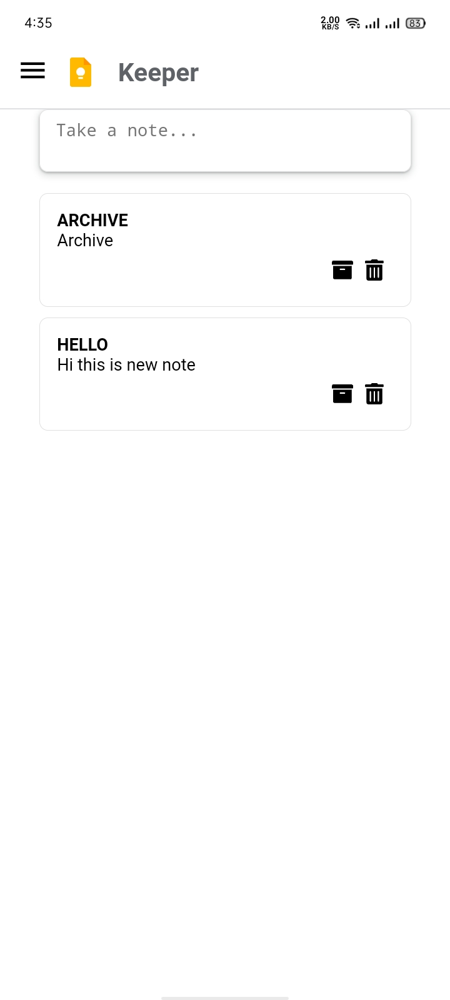

# Google Keep Clone

This project mimics the functionality of Google Keep, allowing users to create, edit, and delete notes.

## Features

- Create and display notes with titles and descriptions
- Delete or Archieve the individual note
- Responsive design for a seamless experience on desktop and mobile devices


## Installation

To run this project locally, follow these steps:

1. **Clone the repository:**
```bash
  git clone https://github.com/alecodify/react-projects.git
```

2. **Navigate to the project directory:**
```bash
  cd react-projects/14-google-keep-clone
```

3. **Install the dependencies:**
```bash
  npm install    
```

4. **Start the development server:**
```bash
  npm run dev
```

Once the server is running, you can access the application in your browser at http://localhost:5173.

## Demo
[Watch the demo video](https://github.com/user-attachments/assets/87658b1a-4377-4e52-a33f-2983c409875a)


## Screenshots

<div style="display: flex; flex-direction: 'row';">


</div>

## Contributing
Contributions are welcome! Please feel free to submit a Pull Request.

## Contact
For any questions or issues, please reach out to imaliraza10@gmail.com