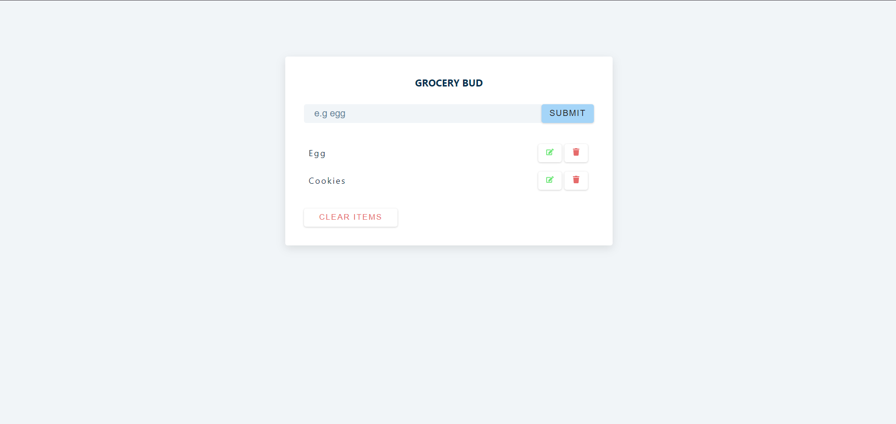
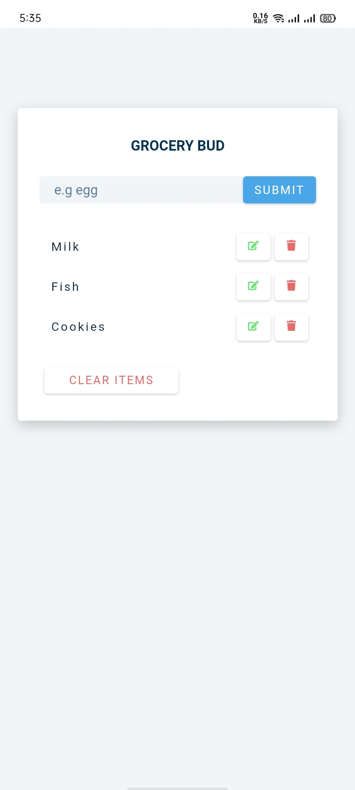

# Grocery Bud

This project is a simple yet practical application designed to help users manage their grocery shopping lists. Users can add items to the list, edit them if necessary, and remove them once they're no longer needed.

## Features

- Add new grocery items to the list
- Edit existing items in the list
- Remove items from the list
- Clear the entire list
- Persistent storage of the list using localStorage


## Installation

To run this project locally, follow these steps:

1. **Clone the repository:**
```bash
  git clone https://github.com/alecodify/react-projects.git
```

2. **Navigate to the project directory:**
```bash
  cd react-projects/15-grocery-bud
```

3. **Install the dependencies:**
```bash
  npm install    
```

4. **Start the development server:**
```bash
  npm run dev
```

Once the server is running, you can access the application in your browser at http://localhost:5173.

## Demo
[Watch the demo video](https://github.com/user-attachments/assets/90c50984-24c8-41c6-ab09-af0fe6e714ac)


## Screenshots

<div style="display: flex; flex-direction: 'row';">

</div>

## Contributing
Contributions are welcome! Please feel free to submit a Pull Request.

## Contact
For any questions or issues, please reach out to imaliraza10@gmail.com