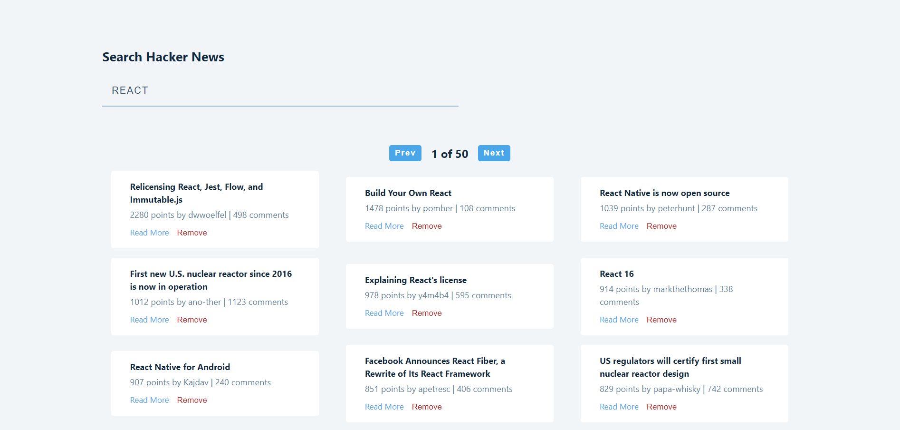
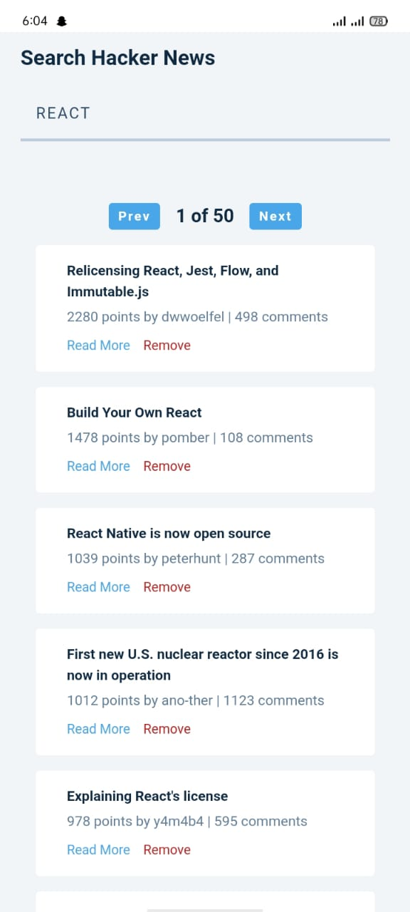
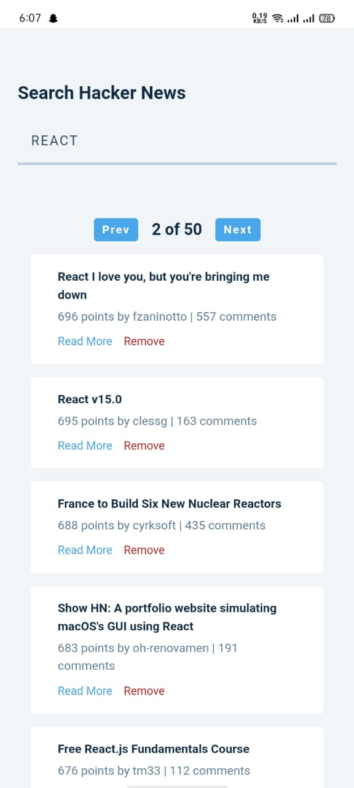

# Hacker News

This project allows users to search, display news articles from the popular Hacker News website.

## Features

- Search for news articles by keyword
- Display a list of relevant articles with titles, links, and points
- Pagination to view more results
- Responsive design for both desktop and mobile screens


## Installation

To run this project locally, follow these steps:

1. **Clone the repository:**
```bash
  git clone https://github.com/alecodify/react-projects.git
```

2. **Navigate to the project directory:**
```bash
  cd react-projects/16-hacker-news
```

3. **Install the dependencies:**
```bash
  npm install    
```

4. **Start the development server:**
```bash
  npm run dev
```

Once the server is running, you can access the application in your browser at http://localhost:5173.

## Demo
[Watch the demo video](https://github.com/user-attachments/assets/cba48bd2-fe97-4166-80ee-e89edba717e0)


## Screenshots

<div style="display: flex; flex-direction: 'row';">


</div>

## Contributing
Contributions are welcome! Please feel free to submit a Pull Request.

## Contact
For any questions or issues, please reach out to imaliraza10@gmail.com