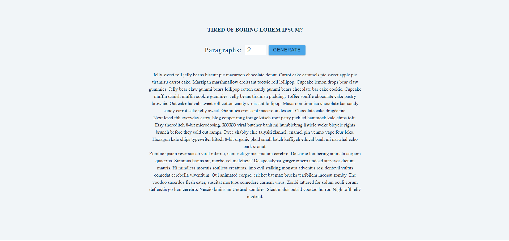
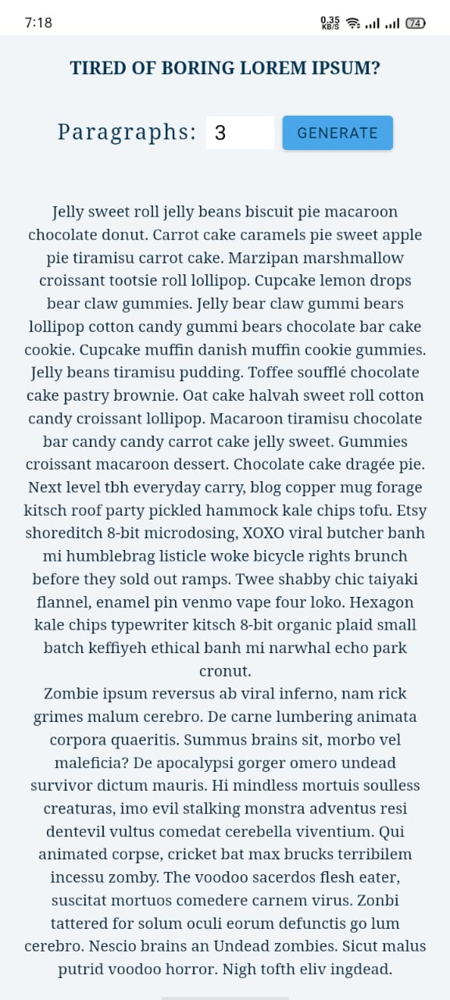

# Lorem Ipsum

This project generates random Lorem Ipsum text based on the number of paragraphs the user requests.

## Features

- Enter the number of paragraphs to generate
- Generate random Lorem Ipsum text dynamically
- Responsive design for mobile and desktop views


## Installation

To run this project locally, follow these steps:

1. **Clone the repository:**
```bash
  git clone https://github.com/alecodify/react-projects.git
```

2. **Navigate to the project directory:**
```bash
  cd react-projects/18-lorem-ipsum
```

3. **Install the dependencies:**
```bash
  npm install    
```

4. **Start the development server:**
```bash
  npm run dev
```

Once the server is running, you can access the application in your browser at http://localhost:5173.

## Demo
[Watch the demo video](https://github.com/user-attachments/assets/43f342c5-9859-4867-955f-cc4aa0b299e8)


## Screenshots

<div style="display: flex; flex-direction: 'row';">


</div>

## Contributing
Contributions are welcome! Please feel free to submit a Pull Request.

## Contact
For any questions or issues, please reach out to imaliraza10@gmail.com