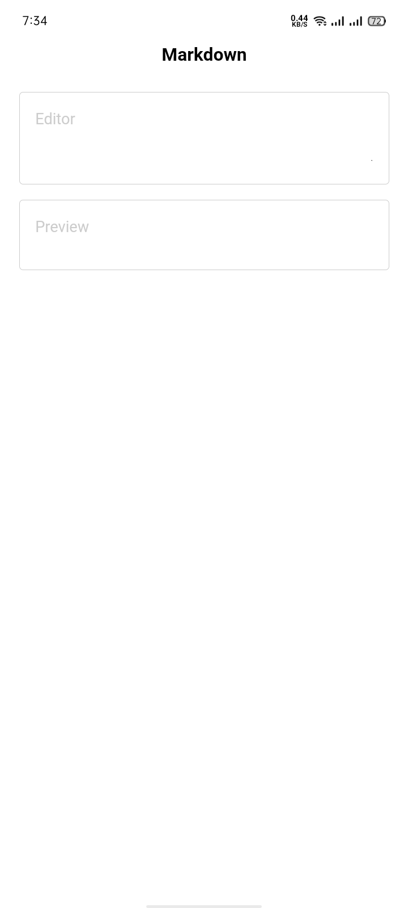

# Markdown Editor and Preview

This project allows users to write Markdown in an editor and immediately see the formatted result in a preview section. This tool is useful for developers, writers, or anyone looking to generate content using Markdown formatting.

## Features

- Write Markdown in a live editor
- See the formatted Markdown content in a live preview
- Supports standard Markdown syntax like headings, lists, links, code blocks, and more
- Responsive design for use on both mobile and desktop devices

## Installation

To run this project locally, follow these steps:

1. **Clone the repository:**
```bash
  git clone https://github.com/alecodify/react-projects.git
```

2. **Navigate to the project directory:**
```bash
  cd react-projects/19-markdown-editor-and-preview
```

3. **Install the dependencies:**
```bash
  npm install    
```

4. **Start the development server:**
```bash
  npm run dev
```

Once the server is running, you can access the application in your browser at http://localhost:5173.

## Demo
[Watch the demo video](https://github.com/user-attachments/assets/60bdba95-901a-495c-8915-2f11063a6f74)


## Screenshots

<div style="display: flex; flex-direction: 'row';">


</div>

## Contributing
Contributions are welcome! Please feel free to submit a Pull Request.

## Contact
For any questions or issues, please reach out to imaliraza10@gmail.com