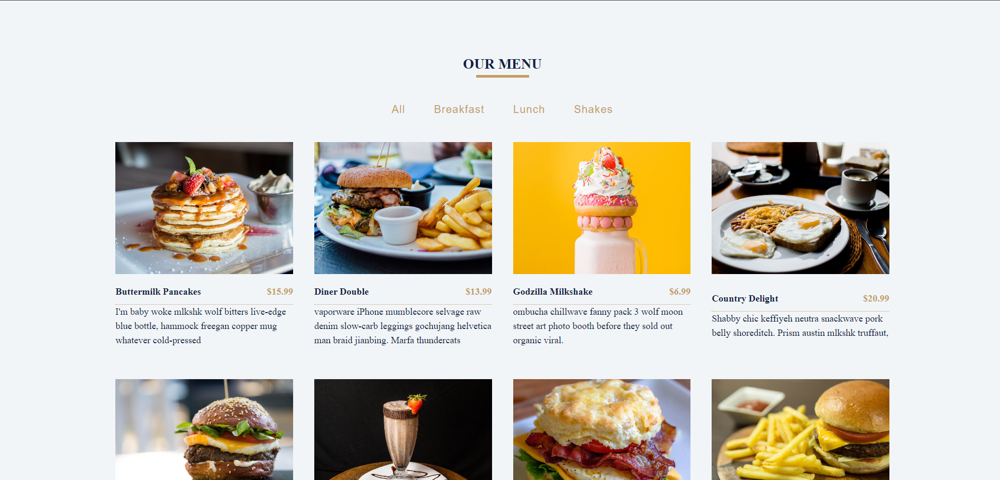
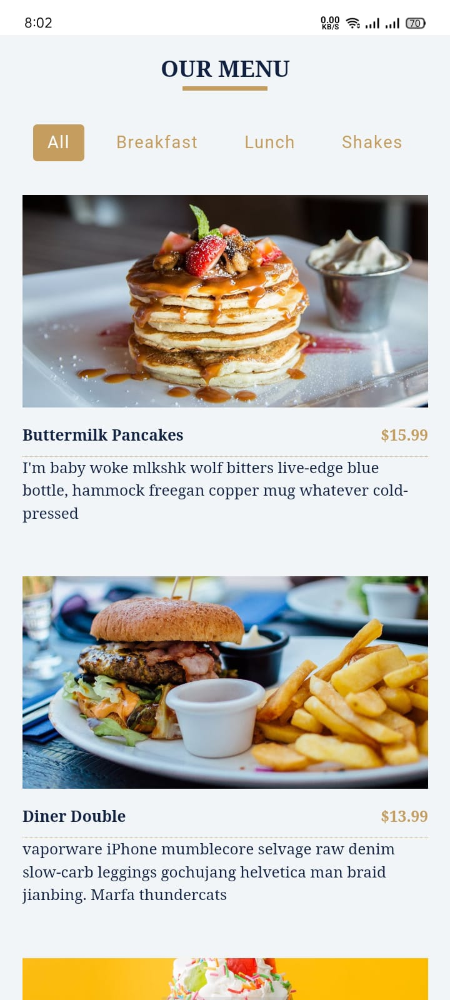
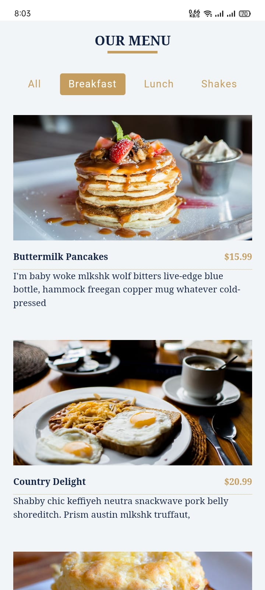
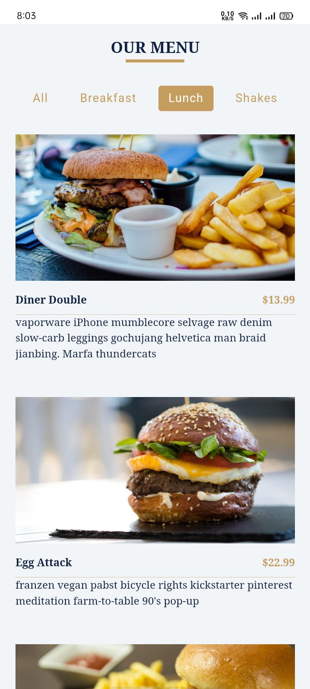

# Menu

The project displays a list of menu items categorized into different sections such as breakfast, lunch, and dinner. It allows users to filter menu items by category.

## Features

- Display a list of menu items with image, title, and description
- Filter items by category (e.g., breakfast, lunch, dinner)
- Show all menu items when no filter is applied
- Responsive design that works on mobile, tablet, and desktop devices

## Installation

To run this project locally, follow these steps:

1. **Clone the repository:**
```bash
  git clone https://github.com/alecodify/react-projects.git
```

2. **Navigate to the project directory:**
```bash
  cd react-projects/20-menu
```

3. **Install the dependencies:**
```bash
  npm install    
```

4. **Start the development server:**
```bash
  npm run dev
```

Once the server is running, you can access the application in your browser at http://localhost:5173.

## Demo
[Watch the demo video](https://github.com/user-attachments/assets/59869592-9bc4-4900-94fb-22302d93691d)

## Screenshots

<div style="display: flex; flex-direction: 'row';">



</div>

## Contributing
Contributions are welcome! Please feel free to submit a Pull Request.

## Contact
For any questions or issues, please reach out to imaliraza10@gmail.com