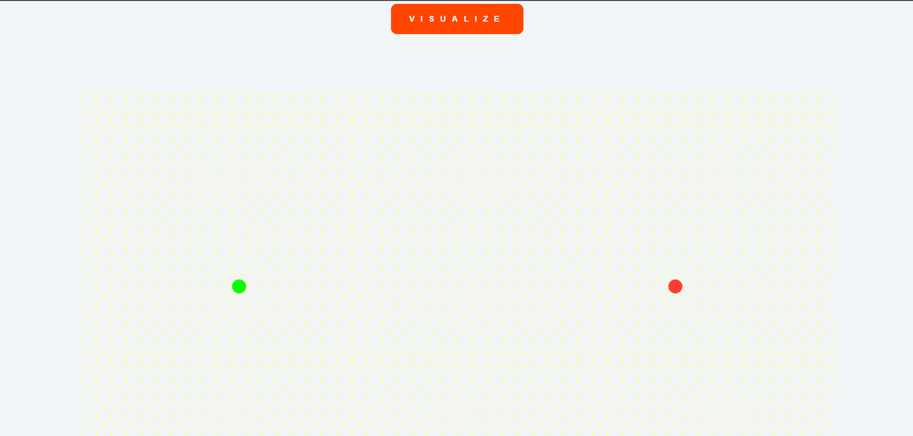

# Path Finding Visualizer

The project provides an interactive grid where users can set start and end points, place obstacles, and visualize how different algorithms find the shortest path between two points.

## Features

- Visualize popular pathfinding algorithms Dijkstra's
- Interactive grid where users can set start and end points
- Real-time animations that show the step-by-step pathfinding process
- Responsive design for only desktop

## Installation

To run this project locally, follow these steps:

1. **Clone the repository:**
```bash
  git clone https://github.com/alecodify/react-projects.git
```

2. **Navigate to the project directory:**
```bash
  cd react-projects/23-path-finding-visualizer
```

3. **Install the dependencies:**
```bash
  npm install    
```

4. **Start the development server:**
```bash
  npm run dev
```

Once the server is running, you can access the application in your browser at http://localhost:5173.

## Screenshots


## Contributing
Contributions are welcome! Please feel free to submit a Pull Request.

## Contact
For any questions or issues, please reach out to imaliraza10@gmail.com