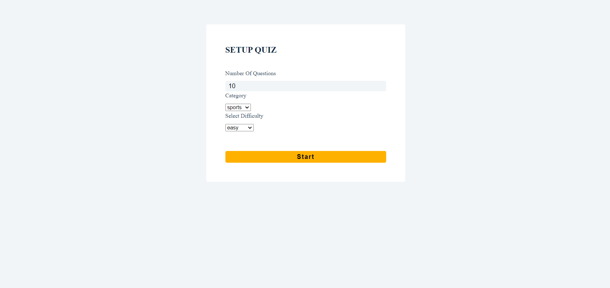
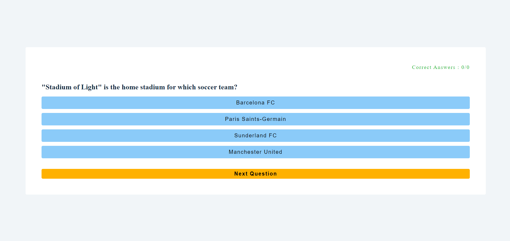
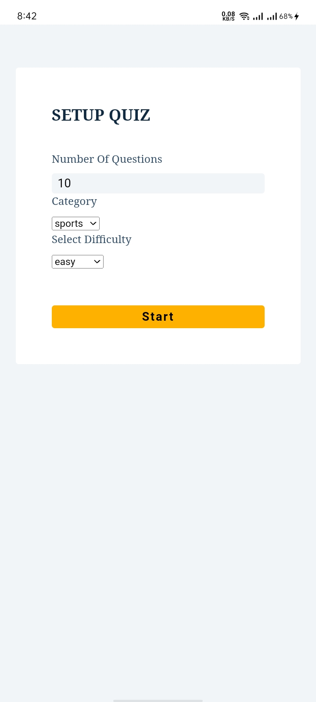
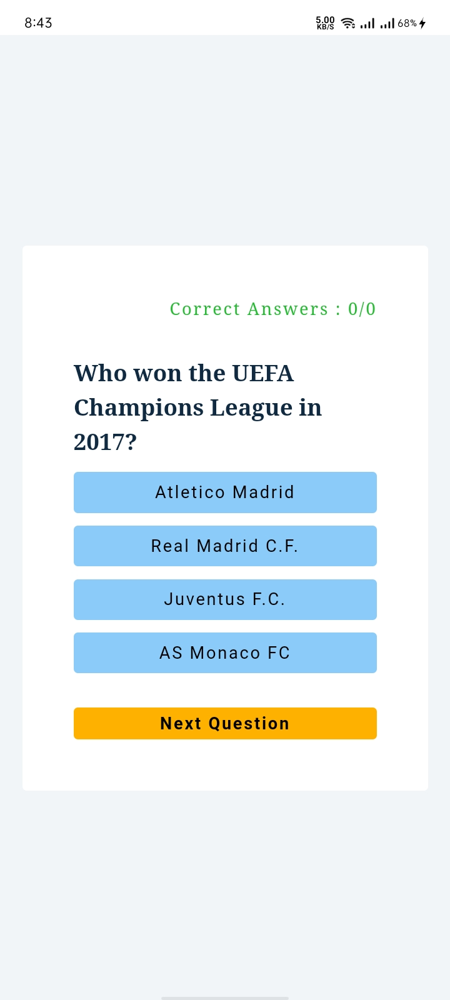
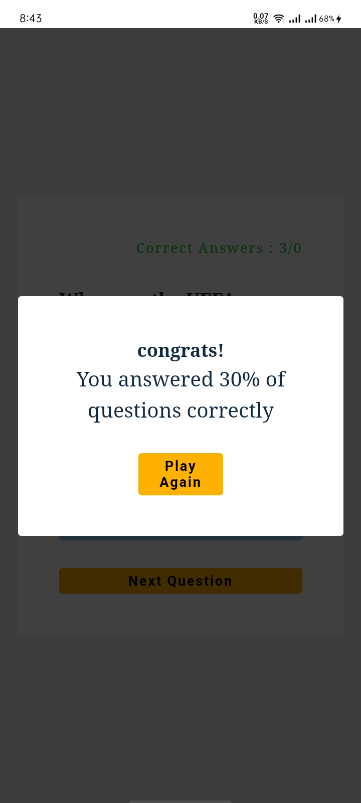

# Quiz

The project provides users with an interactive quiz experience. It allows users to take a quiz, answering multiple-choice questions with instant feedback on their responses.

## Features

- Multiple-choice quiz questions
- Dynamic question loading
- Displays score at the end of the quiz
- Responsive design, suitable for mobile and desktop use

## Installation

To run this project locally, follow these steps:

1. **Clone the repository:**
```bash
  git clone https://github.com/alecodify/react-projects.git
```

2. **Navigate to the project directory:**
```bash
  cd react-projects/24-quiz
```

3. **Install the dependencies:**
```bash
  npm install    
```

4. **Start the development server:**
```bash
  npm run dev
```

Once the server is running, you can access the application in your browser at http://localhost:5173.

## Demo
[Watch the demo video](https://github.com/user-attachments/assets/587cd48e-8d35-429c-b255-280e617619c6)

## Screenshots


<div style="display: flex; flex-direction: 'row';">



</div>

## Contributing
Contributions are welcome! Please feel free to submit a Pull Request.

## Contact
For any questions or issues, please reach out to imaliraza10@gmail.com