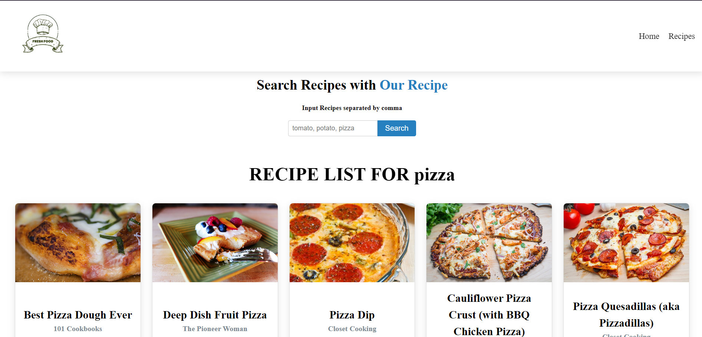
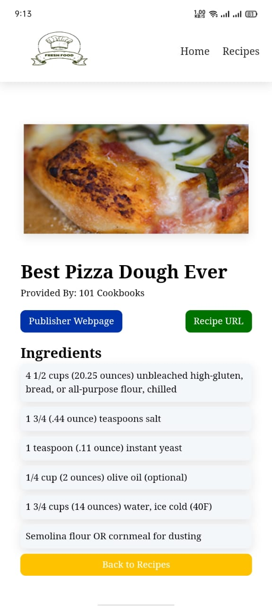

# Recipe Finder

The project allows users to search for recipes by fetching data from a recipe API. Users can input ingredients or dish names, and the app will display a list of relevant recipes along with details such as ingredients, instructions, and images.

## Features

- Search for recipes by keyword (e.g., name, ingredient)
- Display a list of recipes including images, ingredients, and instructions
- Responsive design for optimal performance on all device sizes

## Installation

To run this project locally, follow these steps:

1. **Clone the repository:**
```bash
  git clone https://github.com/alecodify/react-projects.git
```

2. **Navigate to the project directory:**
```bash
  cd react-projects/26-recipe-finder
```

3. **Install the dependencies:**
```bash
  npm install    
```

4. **Start the development server:**
```bash
  npm run dev
```

Once the server is running, you can access the application in your browser at http://localhost:5173.

## Demo
[Watch the demo video](https://github.com/user-attachments/assets/1666f7ef-910a-4c45-8f4c-82396e305662)

## Screenshots


<div style="display: flex; flex-direction: 'row';">



</div>

## Contributing
Contributions are welcome! Please feel free to submit a Pull Request.

## Contact
For any questions or issues, please reach out to imaliraza10@gmail.com