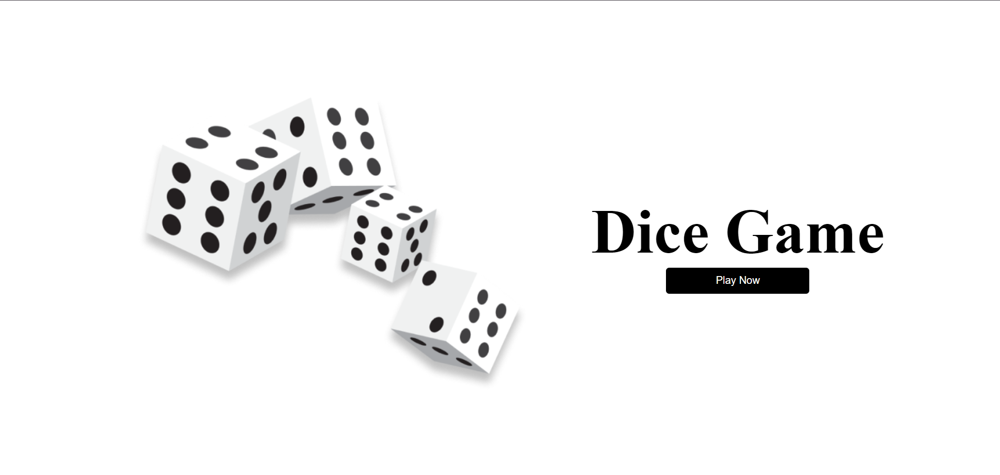
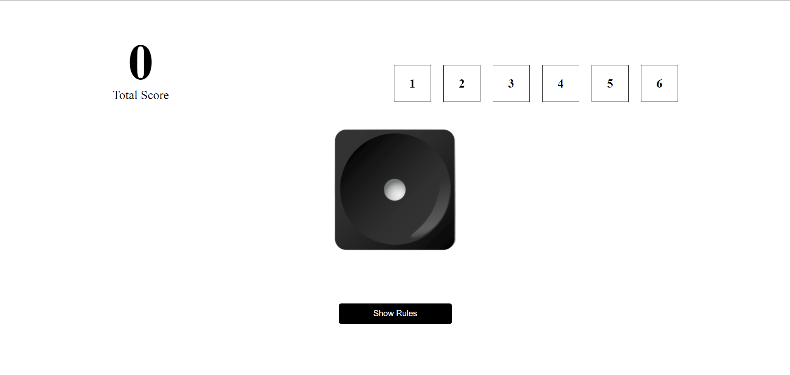
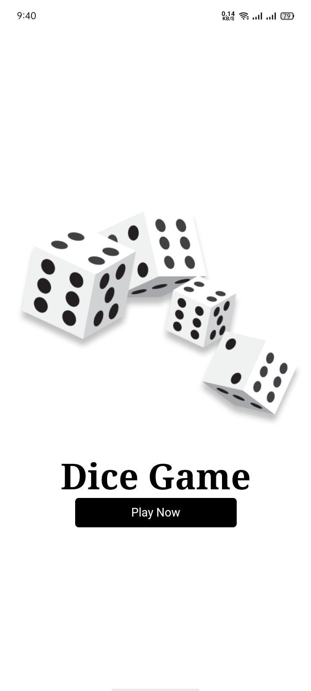
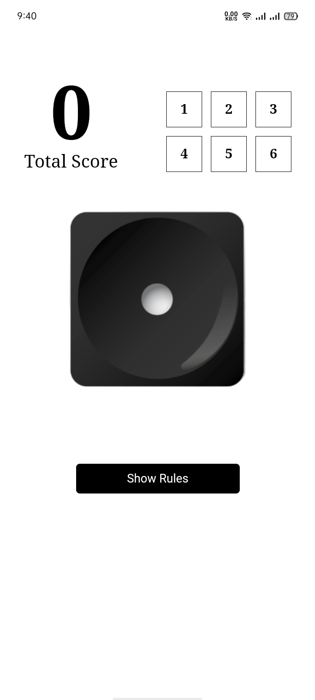
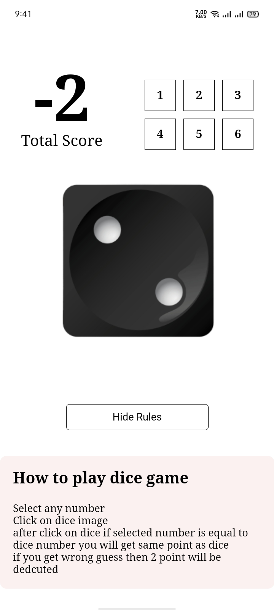

# Roll Dice Game

The project simulates the rolling of dice. Users can roll a dice with random value and enjoy a simple and interactive experience.

## Features

- Select any number
- Click on dice image
- after click on dice if selected number is equal to dice number you will get same point as dice
- if you get wrong guess then 2 point will be dedcuted
- Responsive design for desktop and mobile

## Installation

To run this project locally, follow these steps:

1. **Clone the repository:**
```bash
  git clone https://github.com/alecodify/react-projects.git
```

2. **Navigate to the project directory:**
```bash
  cd react-projects/28-roll-dice
```

3. **Install the dependencies:**
```bash
  npm install    
```

4. **Start the development server:**
```bash
  npm run dev
```

Once the server is running, you can access the application in your browser at http://localhost:5173.

## Demo
[Watch the demo video](https://github.com/user-attachments/assets/0e32a5b9-9936-4ff5-842f-0d094a655839)

## Screenshots


<div style="display: flex; flex-direction: 'row';">



</div>

## Contributing
Contributions are welcome! Please feel free to submit a Pull Request.

## Contact
For any questions or issues, please reach out to imaliraza10@gmail.com