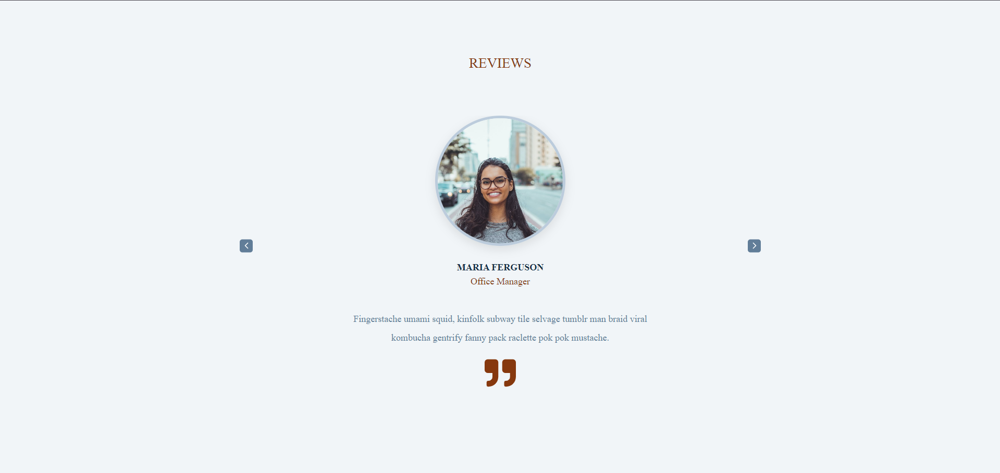
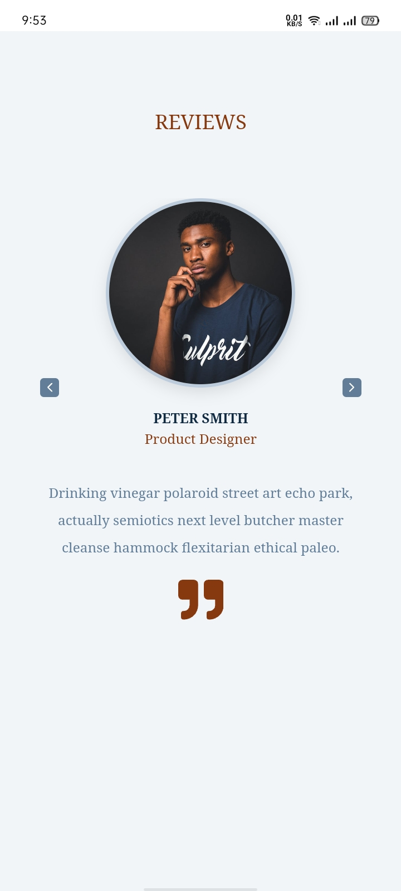

# Slider

This project allows users to browse through a collection of reviews card by navigating back and forth using buttons or automatic transitions.

## Features

- Navigate through the review card using "Next" and "Previous" buttons
- Automatic transitions for a continuous slideshow
- Responsive design for different screen sizes

## Installation

To run this project locally, follow these steps:

1. **Clone the repository:**
```bash
  git clone https://github.com/alecodify/react-projects.git
```

2. **Navigate to the project directory:**
```bash
  cd react-projects/29-slider
```

3. **Install the dependencies:**
```bash
  npm install    
```

4. **Start the development server:**
```bash
  npm run dev
```

Once the server is running, you can access the application in your browser at http://localhost:5173.

## Demo
[Watch the demo video](https://github.com/user-attachments/assets/36ea9eb1-d13d-411f-a8ca-519549710828)

## Screenshots

<div style="display: flex; flex-direction: 'row';">


</div>

## Contributing
Contributions are welcome! Please feel free to submit a Pull Request.

## Contact
For any questions or issues, please reach out to imaliraza10@gmail.com