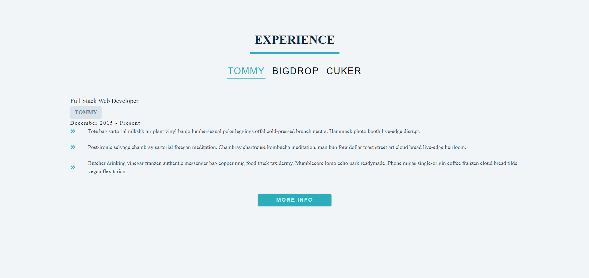
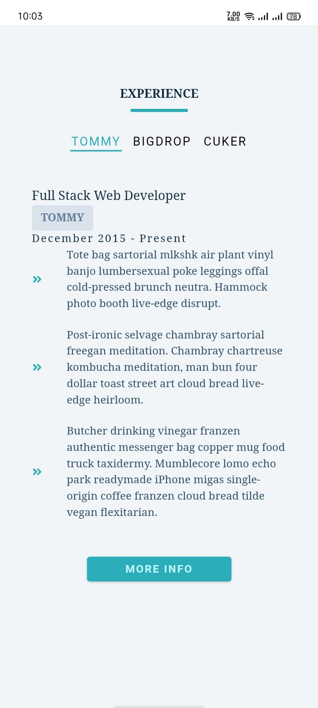
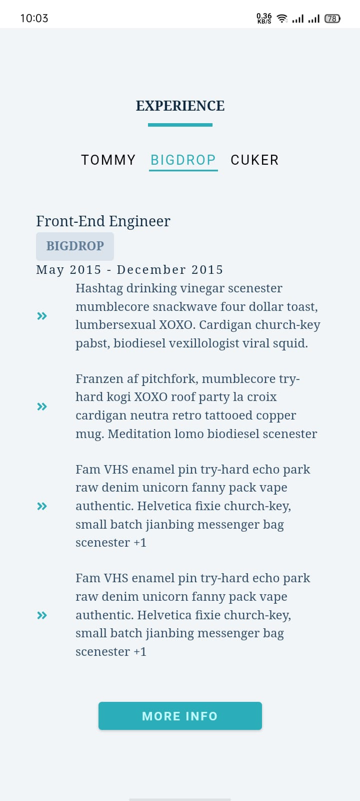
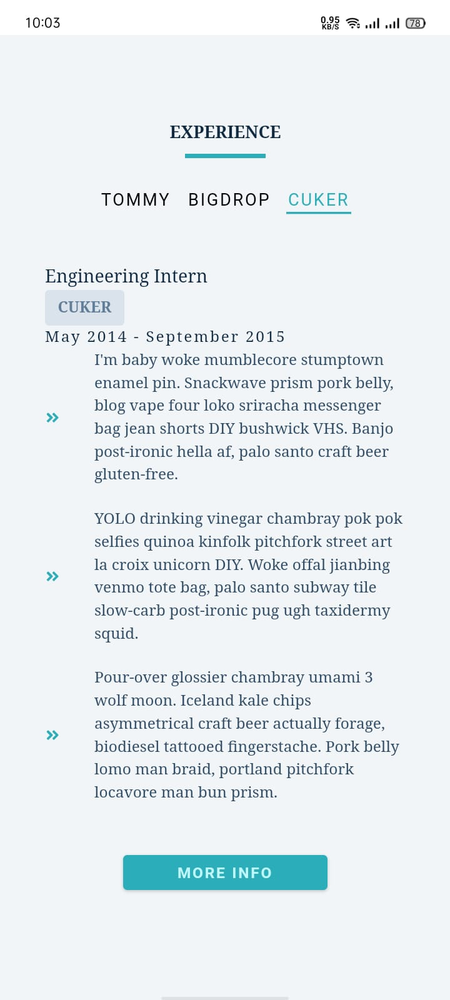

# Tabs

The project implements a tabbed interface, allowing users to switch between different content sections by clicking on the tabs.

## Features

- Content changes based on the selected tab
- Smooth transitions between tab switches
- Responsive design, working across desktop and mobile devices

## Installation

To run this project locally, follow these steps:

1. **Clone the repository:**
```bash
  git clone https://github.com/alecodify/react-projects.git
```

2. **Navigate to the project directory:**
```bash
  cd react-projects/30-tabs
```

3. **Install the dependencies:**
```bash
  npm install    
```

4. **Start the development server:**
```bash
  npm run dev
```

Once the server is running, you can access the application in your browser at http://localhost:5173.

## Demo
[Watch the demo video](https://github.com/user-attachments/assets/bed206d9-81d0-4adc-a10d-a4636cd24055)

## Screenshots

<div style="display: flex; flex-direction: 'row';">



</div>

## Contributing
Contributions are welcome! Please feel free to submit a Pull Request.

## Contact
For any questions or issues, please reach out to imaliraza10@gmail.com