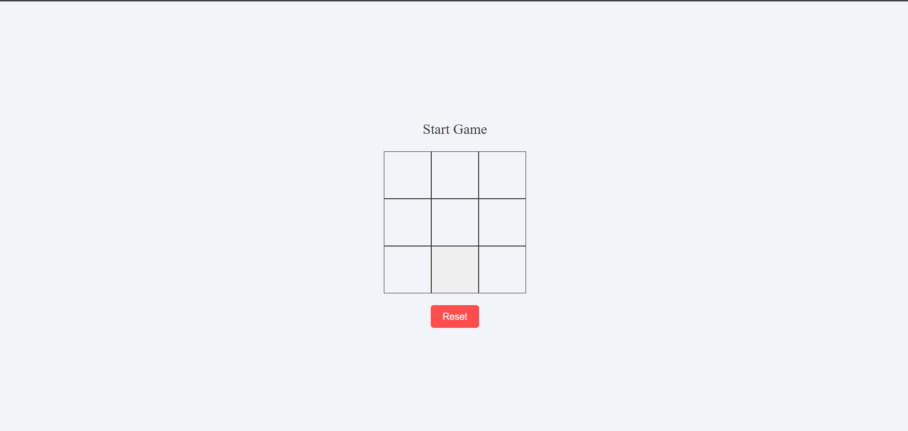
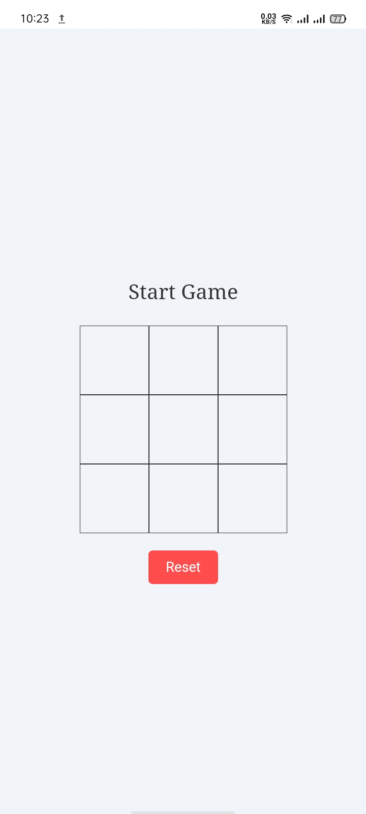
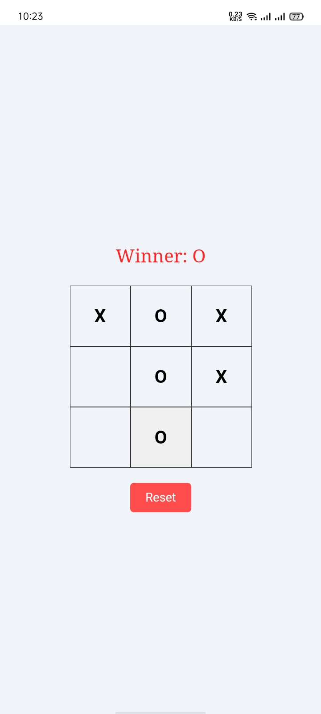
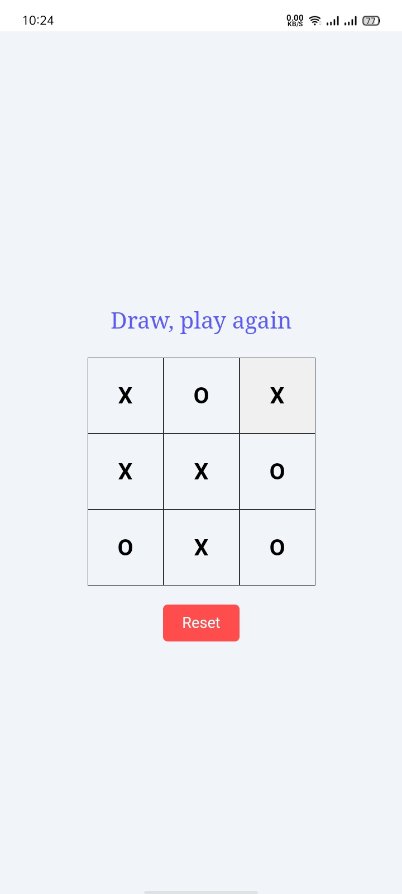

# Tic Tac Toe

The project is a traditional Tic-Tac-Toe game, where two players alternate turns marking their symbol (X or O) on a 3x3 grid. The game automatically checks for win conditions and ends the game when a player wins or a tie occurs.

## Features

- Two-player mode where players take turns
- Automatic detection of game outcomes: wins, losses, and ties
- Reset button to start a new game
- Displays the current player's turn
- Simple and clean design with responsive layout

## Installation

To run this project locally, follow these steps:

1. **Clone the repository:**
```bash
  git clone https://github.com/alecodify/react-projects.git
```

2. **Navigate to the project directory:**
```bash
  cd react-projects/31-tic-tac-toe
```

3. **Install the dependencies:**
```bash
  npm install    
```

4. **Start the development server:**
```bash
  npm run dev
```

Once the server is running, you can access the application in your browser at http://localhost:5173.

## Demo
[Watch the demo video](https://github.com/user-attachments/assets/19dbcc53-818f-44d7-9187-637036a421e5)

## Screenshots

<div style="display: flex; flex-direction: 'row';">



</div>

## Contributing
Contributions are welcome! Please feel free to submit a Pull Request.

## Contact
For any questions or issues, please reach out to imaliraza10@gmail.com