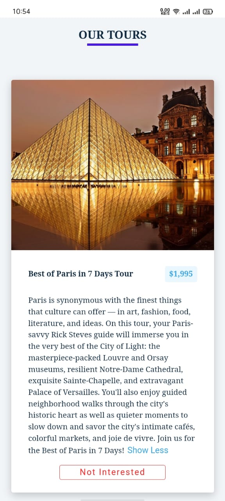

# Tours

The project provides a user-friendly interface for browsing different travel tours. Users can view detailed information about each destination and manage the list of tours by removing items as needed.

## Features

- Display a list of travel tours with details
- View information about each destination
- Remove tour from the list
- Responsive design for different screen sizes

## Installation

To run this project locally, follow these steps:

1. **Clone the repository:**
```bash
  git clone https://github.com/alecodify/react-projects.git
```

2. **Navigate to the project directory:**
```bash
  cd react-projects/33-tours
```

3. **Install the dependencies:**
```bash
  npm install    
```

4. **Start the development server:**
```bash
  npm run dev
```

Once the server is running, you can access the application in your browser at http://localhost:5173.

## Demo
[Watch the demo video](https://github.com/user-attachments/assets/f23b881c-4f87-4488-a18f-1d1d2c509e47)

## Screenshots

<div style="display: flex; flex-direction: 'row';">


</div>

## Contributing
Contributions are welcome! Please feel free to submit a Pull Request.

## Contact
For any questions or issues, please reach out to imaliraza10@gmail.com