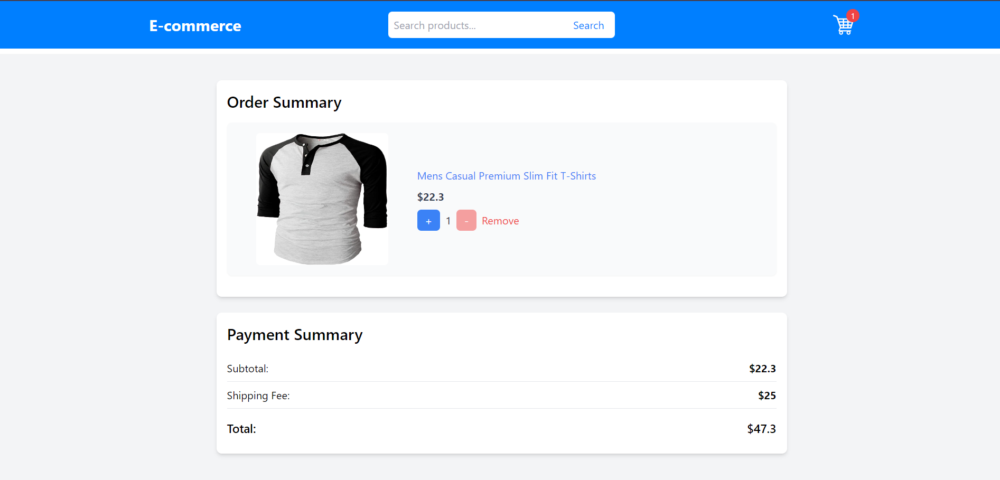

# Ecommerce

The project is a fully functional online shopping platform built using React. It allows users to explore a wide range of products, view detailed product information, and manage their shopping cart. This project demonstrates key e-commerce features such as product listing, cart management, and user interaction.

## Features

- Browse a list of products with images, names, and prices
- View detailed information about each product
- Add products to the shopping cart
- View and manage items in the shopping cart
- Responsive design for both desktop and mobile devices

## Installation

To run this project locally, follow these steps:

1. **Clone the repository:**
```bash
  git clone https://github.com/alecodify/react-projects.git
```

2. **Navigate to the project directory:**
```bash
  cd react-projects/34-ecommerce
```

3. **Install the dependencies:**
```bash
  npm install    
```

4. **Start the development server:**
```bash
  npm run dev
```

Once the server is running, you can access the application in your browser at http://localhost:5173.

## Demo
[Watch the demo video](https://github.com/user-attachments/assets/c107d3ae-5b0c-4634-89ad-eecafbeac1b2)

## Screenshots



<div style="display: flex; flex-direction: 'row';">


</div>

## Contributing
Contributions are welcome! Please feel free to submit a Pull Request.

## Contact
For any questions or issues, please reach out to imaliraza10@gmail.com