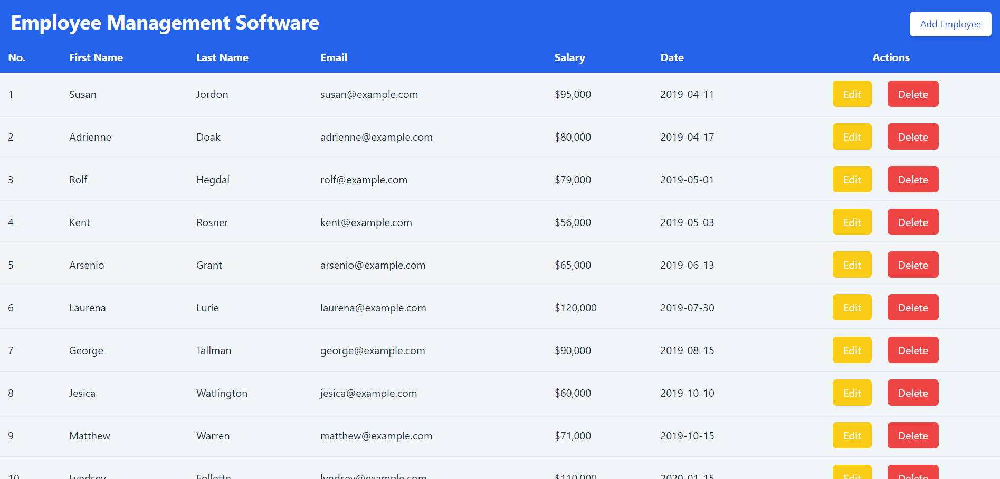
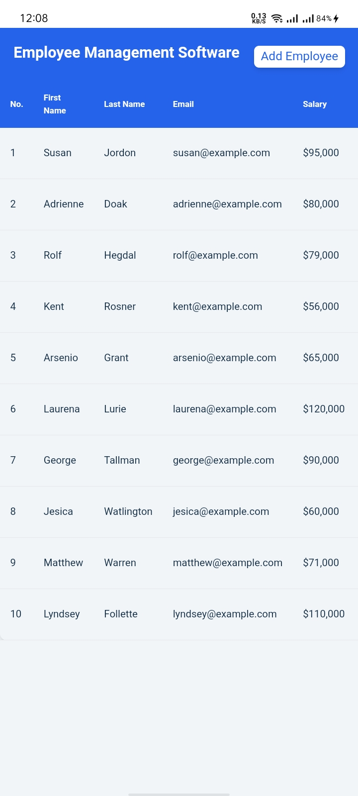
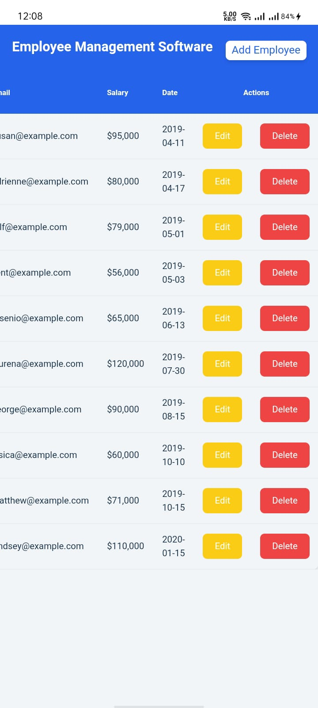
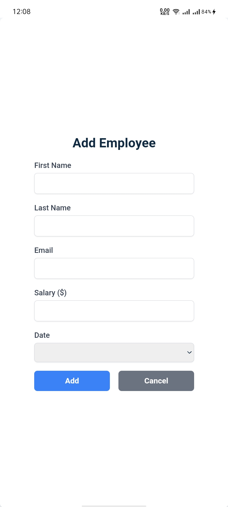

# Employee Management System

This project allows users to efficiently manage employee data with an intuitive user interface. This application is ideal for HR departments or organizations that need a centralized system for handling employee records. Key features include managing employee details, updating records, and removing entries.

## Features

- View a list of employees with their details
- Add new employee records
- Edit existing employee information
- Delete employee records
- Responsive design suitable for desktop and mobile views
- For Mobile Screen is provided the horizontal scroll view to see the employee details

## Installation

To run this project locally, follow these steps:

1. **Clone the repository:**
```bash
  git clone https://github.com/alecodify/react-projects.git
```

2. **Navigate to the project directory:**
```bash
  cd react-projects/35-employee-managament-system
```

3. **Install the dependencies:**
```bash
  npm install    
```

4. **Start the development server:**
```bash
  npm run dev
```

Once the server is running, you can access the application in your browser at http://localhost:5173.

## Demo
[Watch the demo video](https://github.com/user-attachments/assets/2b70507c-fb43-4506-bc0e-f0362b2811db)

## Screenshots

<div style="display: flex; flex-direction: 'row';">



</div>

## Contributing
Contributions are welcome! Please feel free to submit a Pull Request.

## Contact
For any questions or issues, please reach out to imaliraza10@gmail.com