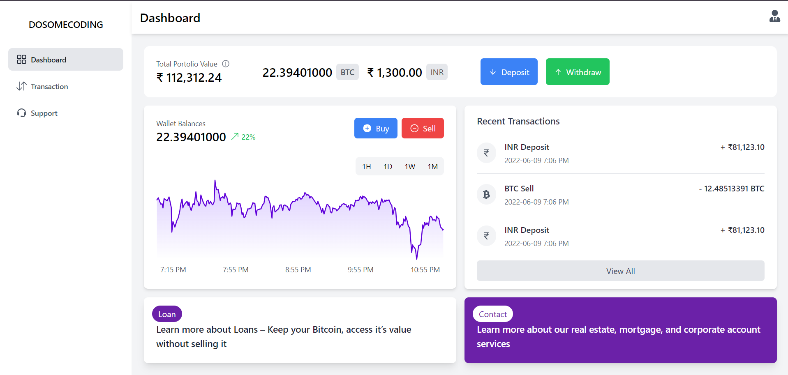
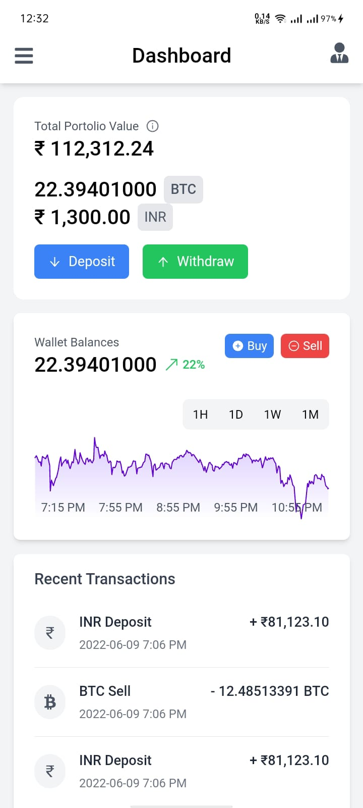
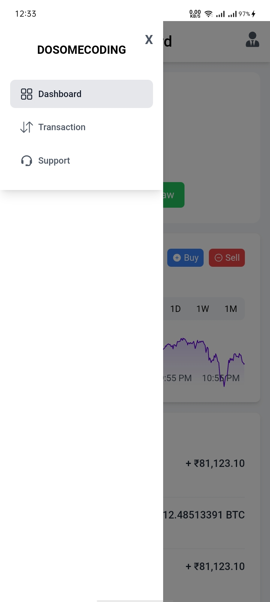
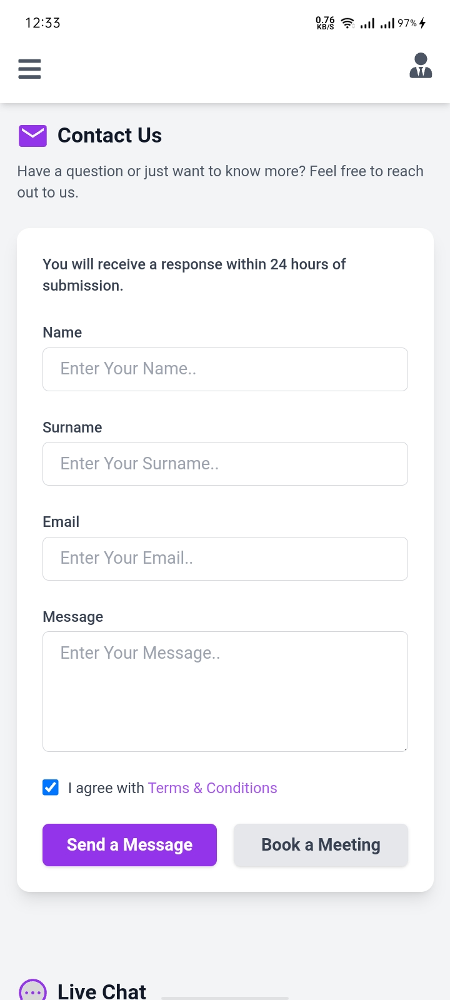

# Transaction

The project helps users efficiently manage their financial transactions. It provides a simple interface for adding and tracking transactions, categorizing them for easy analysis, and viewing a summary of financial activity.

## Features

- It is simple ui project no functionality added
- View a list of financial transactions with details
- Responsive design for both desktop and mobile devices

## Installation

To run this project locally, follow these steps:

1. **Clone the repository:**
```bash
  git clone https://github.com/alecodify/react-projects.git
```

2. **Navigate to the project directory:**
```bash
  cd react-projects/36-transaction
```

3. **Install the dependencies:**
```bash
  npm install    
```

4. **Start the development server:**
```bash
  npm run dev
```

Once the server is running, you can access the application in your browser at http://localhost:5173.

## Demo
[Watch the demo video](https://github.com/user-attachments/assets/dbeba592-a7cf-4cb9-94f8-4be226166232)

## Screenshots

<div style="display: flex; flex-direction: 'row';">



</div>

## Contributing
Contributions are welcome! Please feel free to submit a Pull Request.

## Contact
For any questions or issues, please reach out to imaliraza10@gmail.com