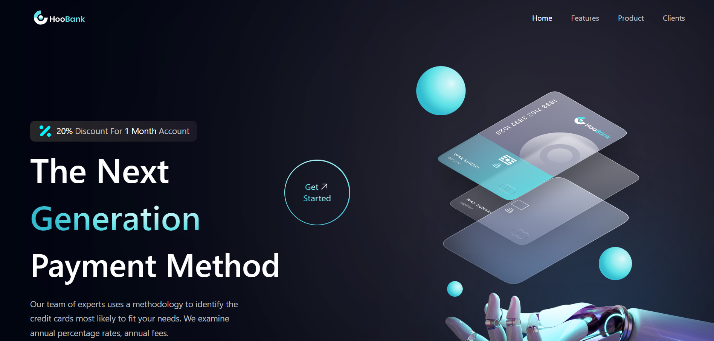
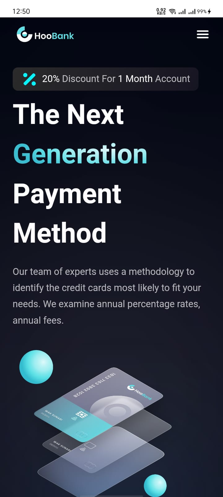
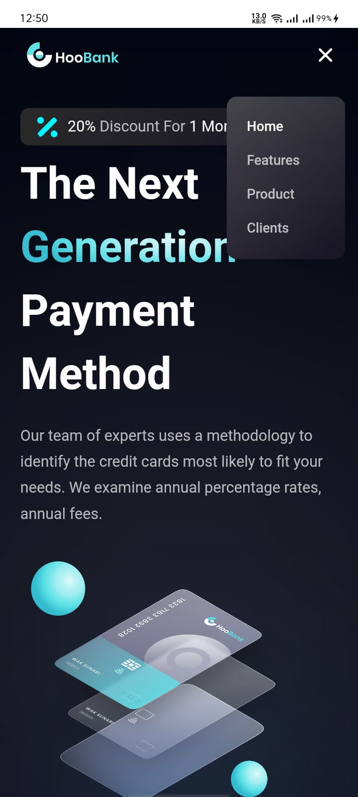
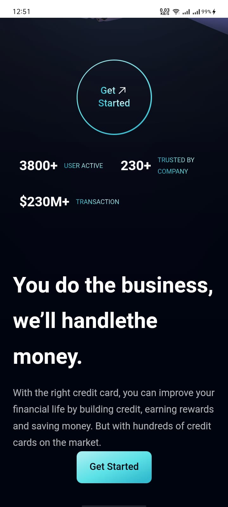
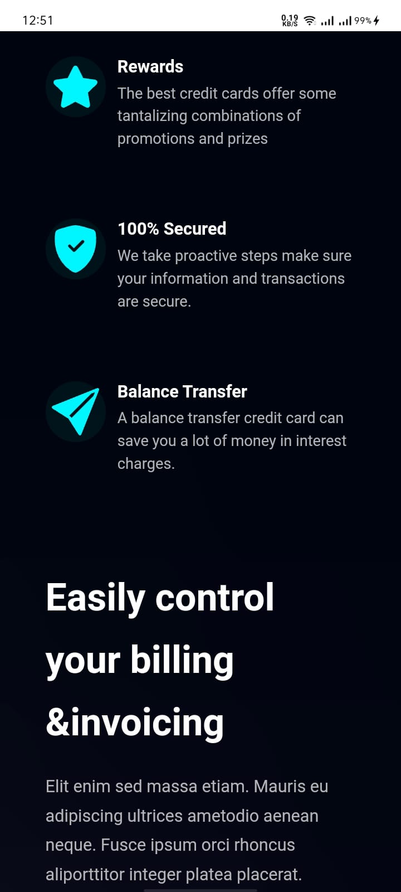
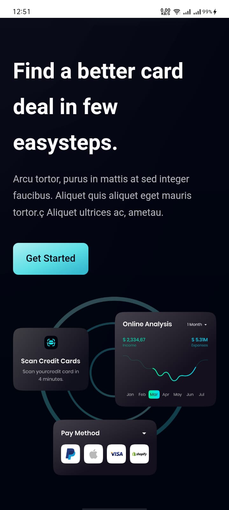
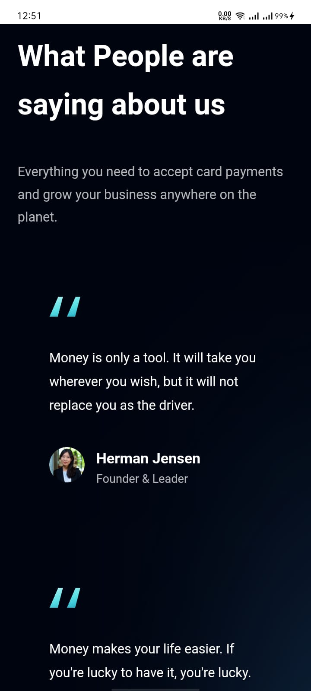
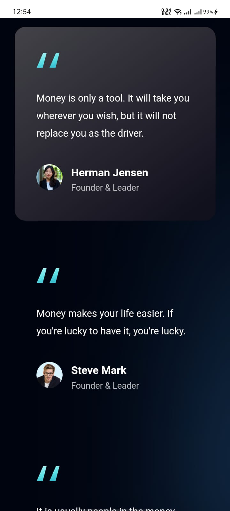
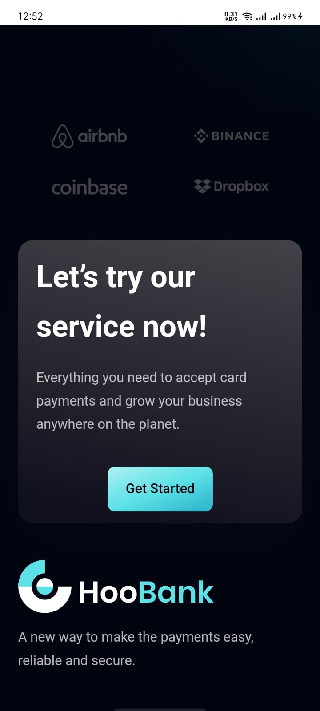
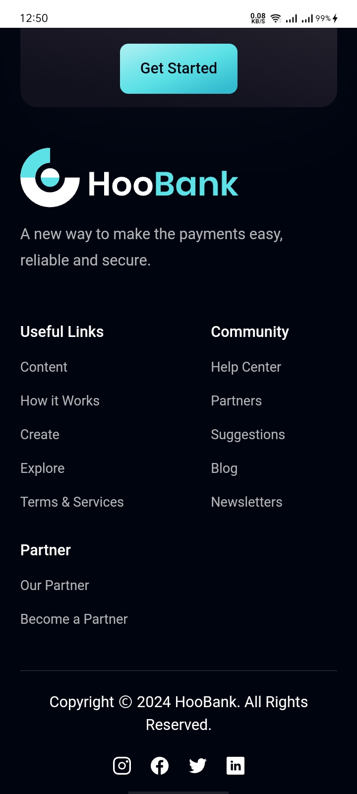

# Hoobank

The project is a straightforward UI for a banking application. It features a minimalistic design aimed at providing users with a smooth and easy-to-use experience. Ideal for learning and showcasing basic UI components.

## Features

- Simple layout for easy navigation
- Basic banking UI elements for demonstration purposes
- Responsive design for different devices

## Installation

To run this project locally, follow these steps:

1. **Clone the repository:**
```bash
  git clone https://github.com/alecodify/react-projects.git
```

2. **Navigate to the project directory:**
```bash
  cd react-projects/37-hoobank
```

3. **Install the dependencies:**
```bash
  npm install    
```

4. **Start the development server:**
```bash
  npm run dev
```

Once the server is running, you can access the application in your browser at http://localhost:5173.

## Demo
[Watch the demo video](https://github.com/user-attachments/assets/21dd7f80-1421-4fbb-8c7e-1adee4bc9f06)

## Screenshots

<div style="display: flex; flex-direction: 'row';">



</div>
<div style="display: flex; flex-direction: 'row';">



</div>
<div style="display: flex; flex-direction: 'row';">



</div>

## Contributing
Contributions are welcome! Please feel free to submit a Pull Request.

## Contact
For any questions or issues, please reach out to imaliraza10@gmail.com