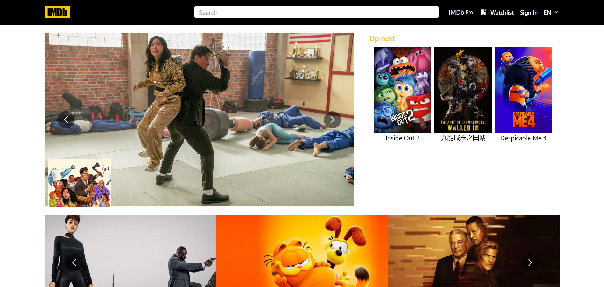
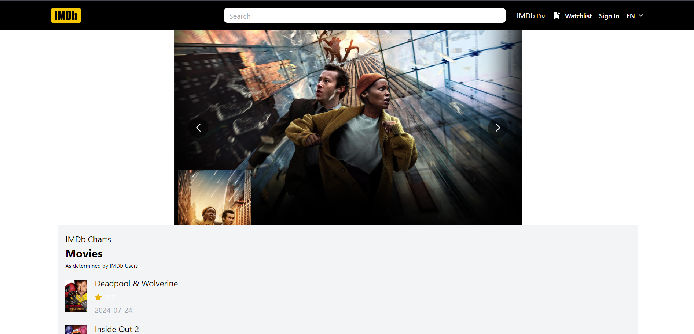
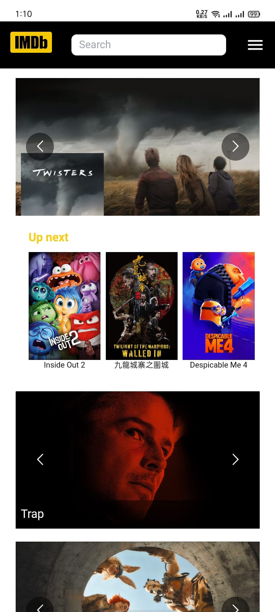
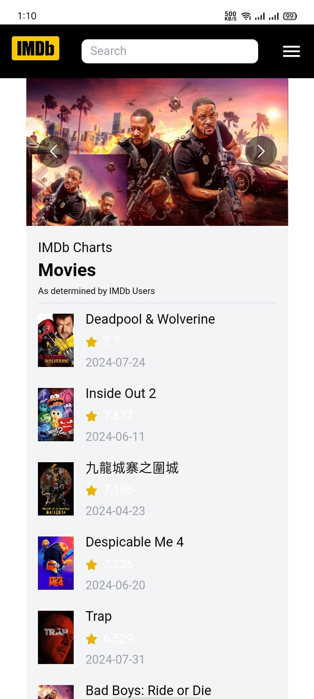

# IMDB Clone

This project is designed to replicate the core features of the original IMDB website. It provides an easy-to-use interface for users to search for movies, view movie details, and explore trending films.

## Features

- View detailed information for each movie
- Browse a list of popular or trending movies
- Responsive design for mobile and desktop views

## Installation

To run this project locally, follow these steps:

1. **Clone the repository:**
```bash
  git clone https://github.com/alecodify/react-projects.git
```

2. **Navigate to the project directory:**
```bash
  cd react-projects/38-imdb-clone
```

3. **Install the dependencies:**
```bash
  npm install    
```

4. **Start the development server:**
```bash
  npm run dev
```

Once the server is running, you can access the application in your browser at http://localhost:5173.

## Demo
[Watch the demo video](https://github.com/user-attachments/assets/96e5663e-aff9-48a4-96c8-e4d4d66de0e4)

## Screenshots


<div style="display: flex; flex-direction: 'row';">


</div>

## Contributing
Contributions are welcome! Please feel free to submit a Pull Request.

## Contact
For any questions or issues, please reach out to imaliraza10@gmail.com