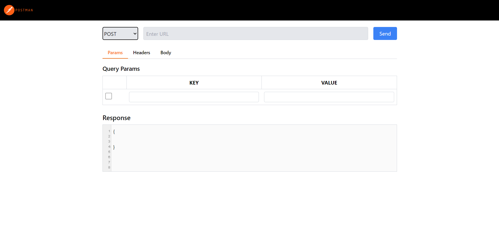
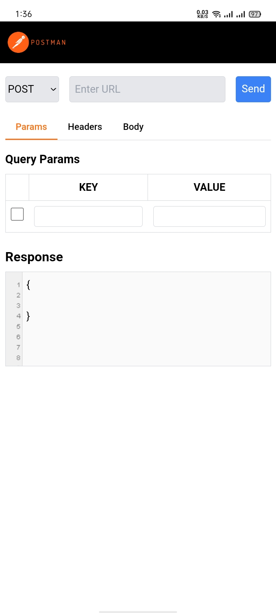
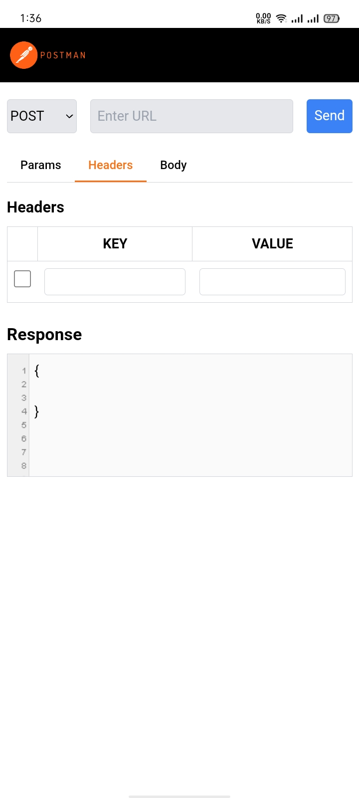
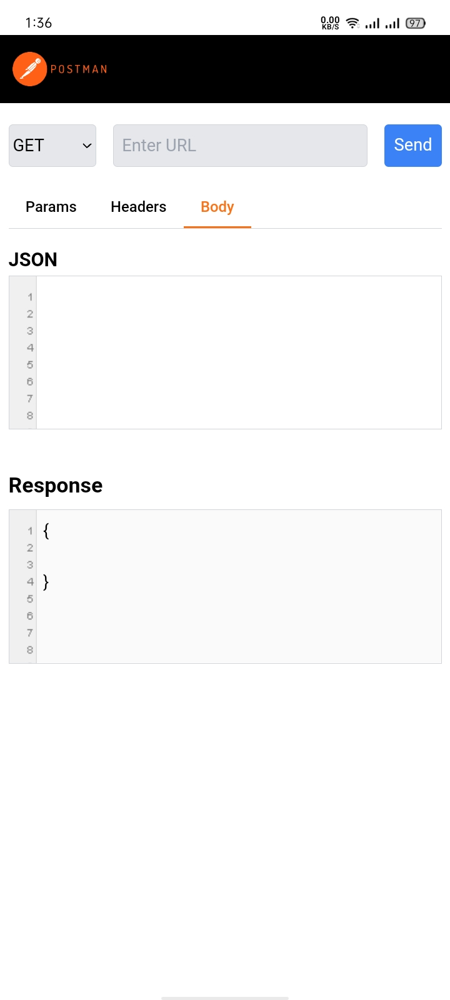

# Postman Clone

This project replicates the core features of Postman, a popular API testing tool. This clone allows users to make HTTP requests (GET, POST) to APIs, inspect responses, and manage requests through a user-friendly interface.

## Features

- Send HTTP requests (GET, POST)
- View real-time responses from APIs
- Manage and organize API requests
- User-friendly interface for making API calls
- Error handling for failed requests
- Responsive design for different screen sizes

## Installation

To run this project locally, follow these steps:

1. **Clone the repository:**
```bash
  git clone https://github.com/alecodify/react-projects.git
```

2. **Navigate to the project directory:**
```bash
  cd react-projects/39-postman-clone
```

3. **Install the dependencies:**
```bash
  npm install    
```

4. **Start the development server:**
```bash
  npm run dev
```

Once the server is running, you can access the application in your browser at http://localhost:5173.

## Demo
[Watch the demo video](https://github.com/user-attachments/assets/a20a91cc-6c59-4603-97fa-31c57fdda4d9)

## Screenshots

<div style="display: flex; flex-direction: 'row';">



</div>

## Contributing
Contributions are welcome! Please feel free to submit a Pull Request.

## Contact
For any questions or issues, please reach out to imaliraza10@gmail.com