# Open Template

This project can be used as a foundation for creating web applications, websites, or other projects. The template includes essential components like a navigation bar, footer, and sample content, which can be easily modified to fit specific requirements.

## Features

- Pre-built structure for rapid project development
- Includes a basic Navbar, Footer, and placeholder sections
- Easily extendable with additional components and features
- Responsive layout for various screen sizes

## Installation

To run this project locally, follow these steps:

1. **Clone the repository:**
```bash
  git clone https://github.com/alecodify/react-projects.git
```

2. **Navigate to the project directory:**
```bash
  cd react-projects/40-open-template
```

3. **Install the dependencies:**
```bash
  npm install    
```

4. **Start the development server:**
```bash
  npm run dev
```

Once the server is running, you can access the application in your browser at http://localhost:5173.

## Demo
[Watch the demo video](https://github.com/user-attachments/assets/dcb48b8e-0bc8-4825-a813-e8b7ad560c20)

## Screenshots
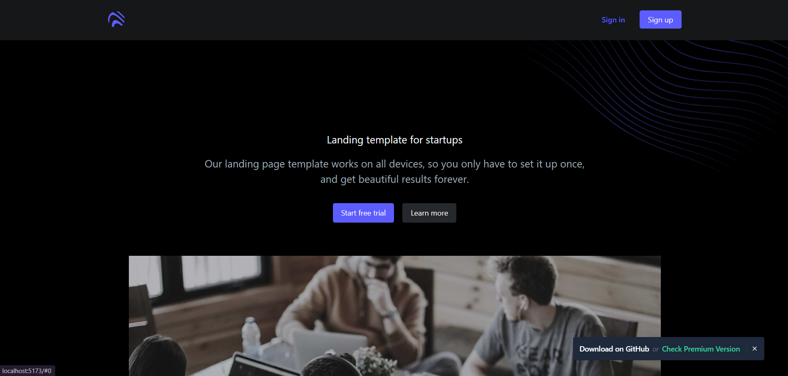
<div style="display: flex; flex-direction: 'row';">
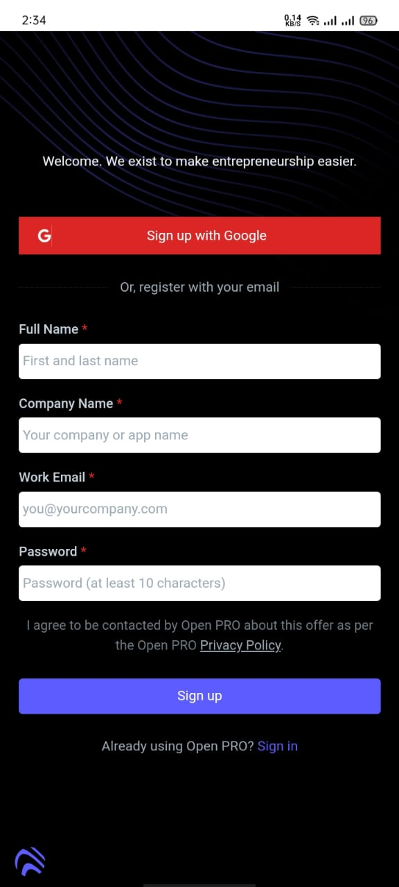
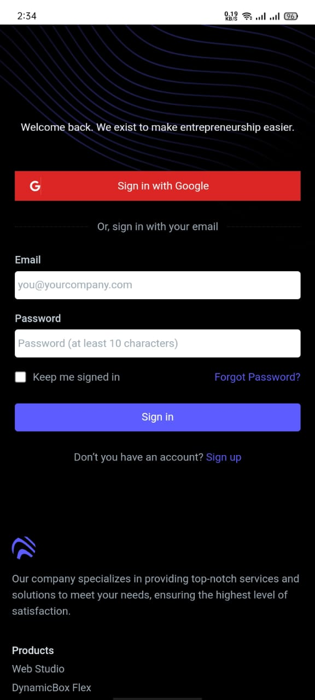
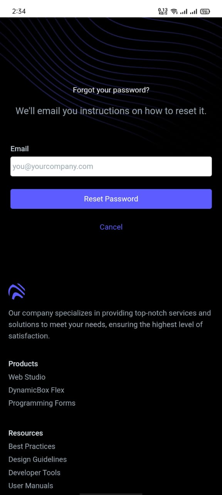
</div>

<div style="display: flex; flex-direction: 'row';">

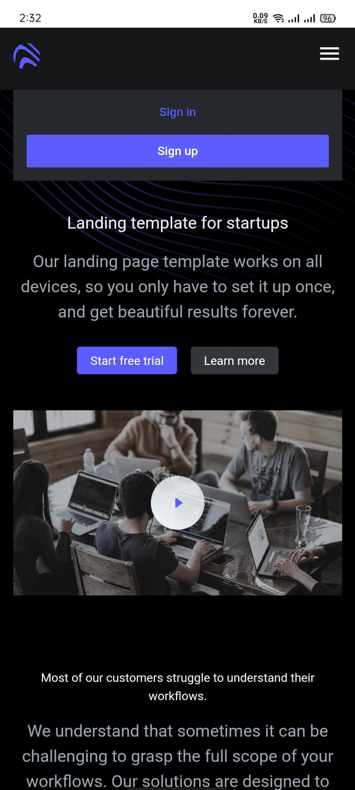
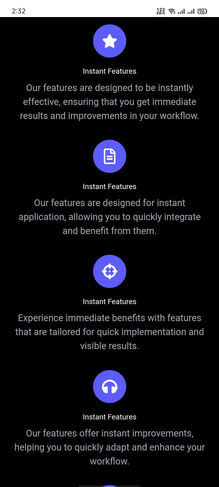
</div>

<div style="display: flex; flex-direction: 'row';">
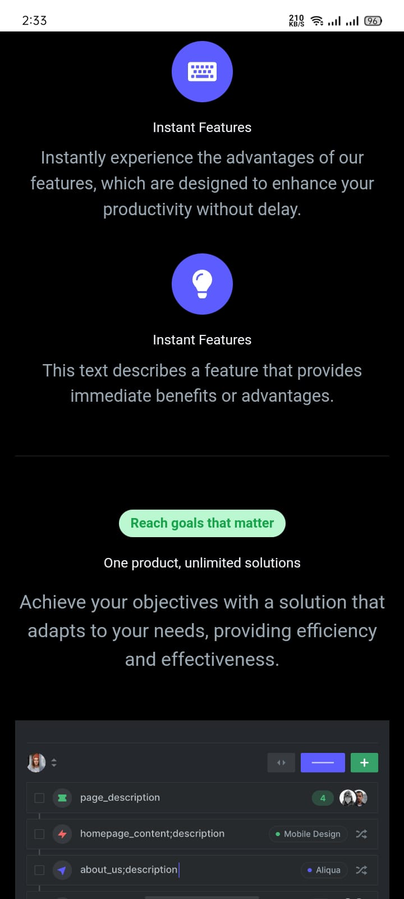
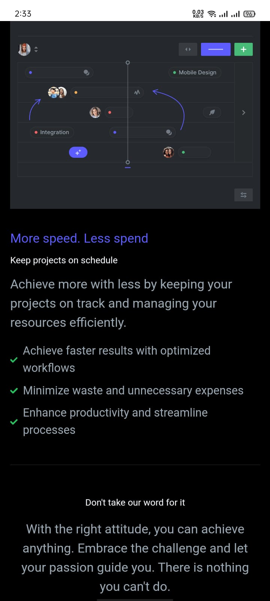
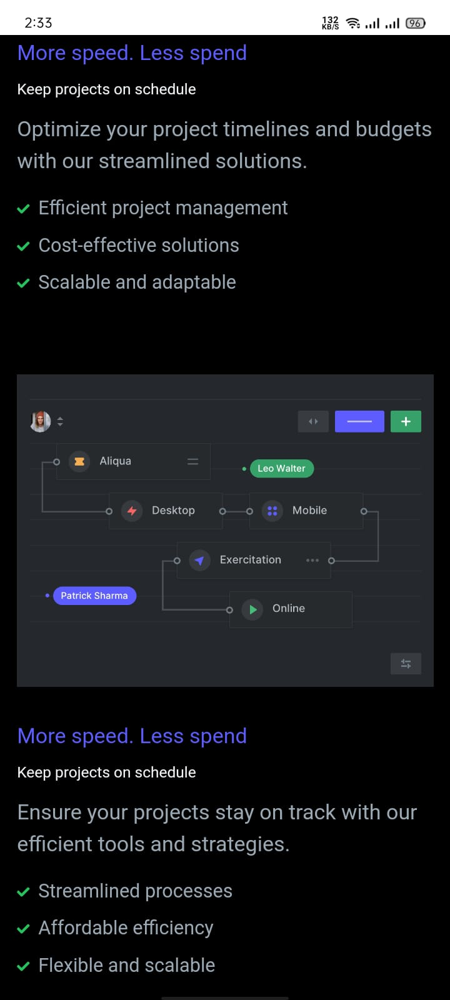
</div>

<div style="display: flex; flex-direction: 'row';">
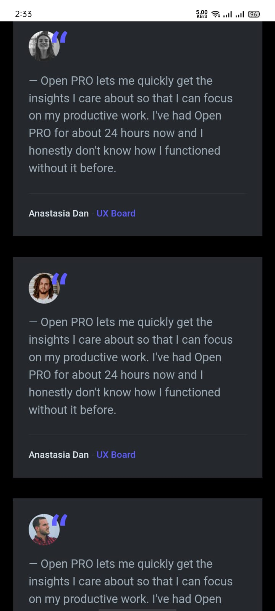

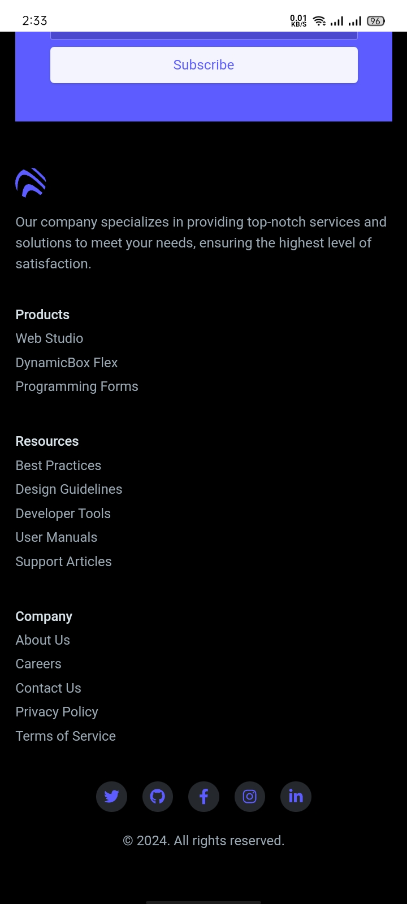
</div>

## Contributing
Contributions are welcome! Please feel free to submit a Pull Request.

## Contact
For any questions or issues, please reach out to imaliraza10@gmail.com